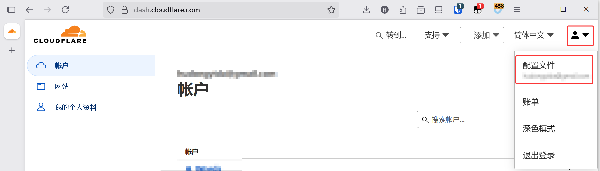
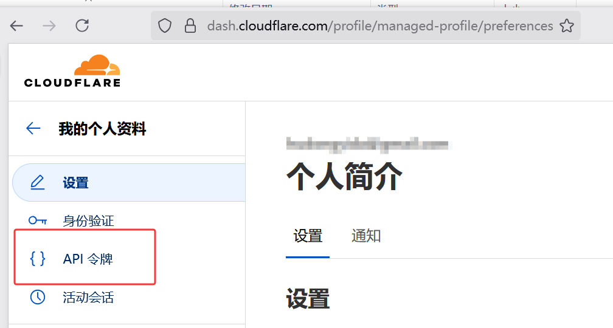
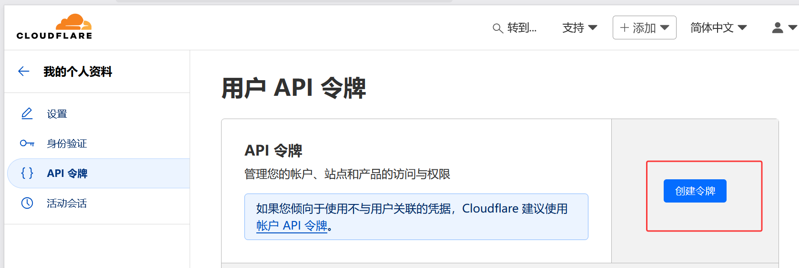
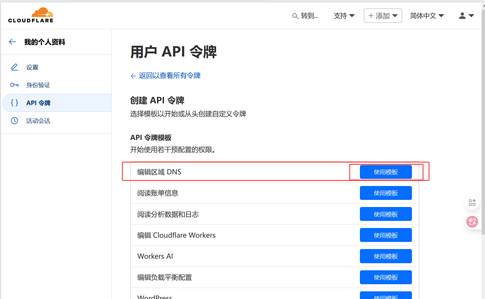
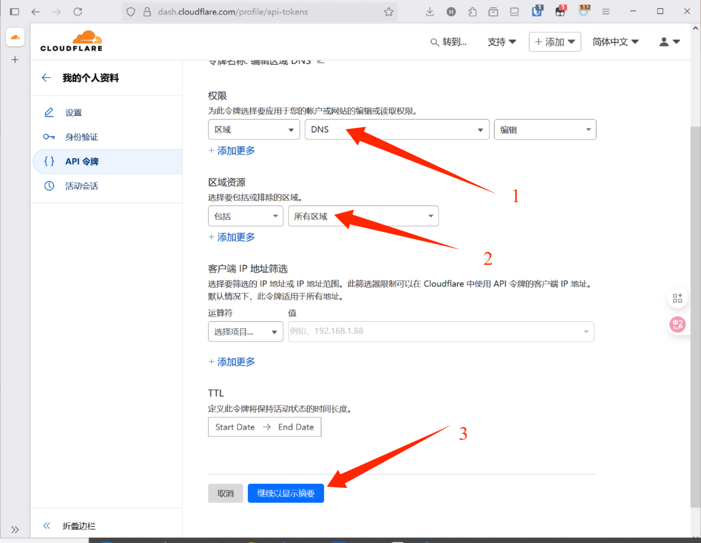
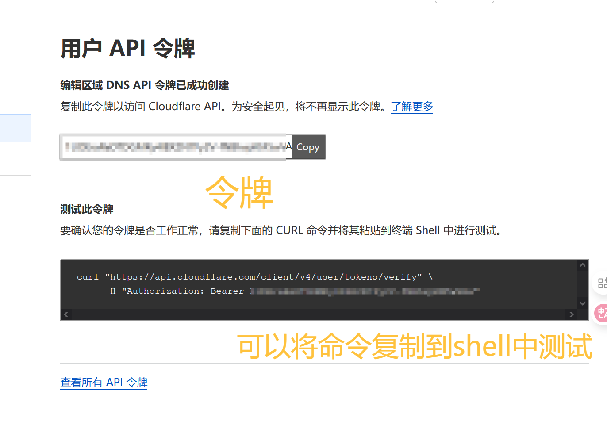

# 使用使用certbot+Let's Encrypt实现ssl证书的自动签发
## 配置certbot
这里使用的是Rocky Linux 9系统进行的演示，centos7使用yum, ubuntu使用apt  
安装certbot
```shell
dnf -y install certbot
```
查找cerbot配套的DNS验证工具
```shell
dnf list | grep certbot-dns
```
显示如下
```
[root@VM-8-5-rockylinux ~]# dnf list | grep certbot-dns
python-certbot-dns-cloudxns-doc.noarch                                                   1.32.0-1.el9                         epel      
python-certbot-dns-dnsimple-doc.noarch                                                   2.1.0-1.el9                          epel      
python3-certbot-dns-cloudflare.noarch                                                    3.1.0-1.el9                          epel      
python3-certbot-dns-cloudxns.noarch                                                      1.32.0-1.el9                         epel      
python3-certbot-dns-digitalocean.noarch                                                  3.1.0-1.el9                          epel      
python3-certbot-dns-dnsimple.noarch                                                      3.1.0-1.el9                          epel      
python3-certbot-dns-dnsmadeeasy.noarch                                                   3.1.0-1.el9                          epel      
python3-certbot-dns-gehirn.noarch                                                        3.1.0-1.el9                          epel      
python3-certbot-dns-linode.noarch                                                        3.1.0-1.el9                          epel      
python3-certbot-dns-luadns.noarch                                                        3.1.0-1.el9                          epel      
python3-certbot-dns-nsone.noarch                                                         3.1.0-1.el9                          epel      
python3-certbot-dns-ovh.noarch                                                           3.1.0-1.el9                          epel      
python3-certbot-dns-rfc2136.noarch                                                       3.1.0-1.el9                          epel      
python3-certbot-dns-route53.noarch                                                       3.1.0-1.el9                          epel      
python3-certbot-dns-sakuracloud.noarch                                                   3.1.0-1.el9                          epel      
```
我这里使用的cloudflare进行的域名管理，所以选择python3-certbot-dns-cloudflare.noarch包进行安装
```shell
dnf -y install python3-certbot-dns-cloudflare
```
如果你使用的国内的DNS服务商可能没有直接包进行安装下面我会给使用阿里云和腾讯云的解决方案  
获取Cloudflare的带有DNS权限的token  
  
  
  
  
  
  
创建一个文件位于`/etc/letsencrypt/cloudflare.ini`,内容如下 `=`后面是token
```
dns_cloudflare_api_token = 1234567890abcdef1234567890abcdef
```
设置权限
```
chmod 600 /etc/letsencrypt/cloudflare.ini
```
### 阿里云
下面内容并非原创，原帖转自[github](https://github.com/tengattack/certbot-dns-aliyun)并且使用翻译软件进行了简单的汉化
1. 获取阿里云的RMA AK SK 并且RMA需要有AliyunDNSFullAccess权限
2. 安装  
- 对于使用PIP
```shell
pip install certbot-dns-aliyun
```
- 对于快照
```shell
sudo snap install certbot-dns-aliyun
sudo snap set certbot trust-plugin-with-root=ok
sudo snap connect certbot:plugin certbot-dns-aliyun
/snap/bin/certbot plugins
```
- 手动安装
```shell
git clone https://github.com/tengattack/certbot-dns-aliyun
cd certbot-dns-aliyun
sudo python setup.py install
```
- 如果您使用的是 certbot-auto，则应先运行 virtualenv【CentOS 7】
```shell
virtualenv --no-site-packages --python "python2.7" "/opt/eff.org/certbot/venv"
/opt/eff.org/certbot/venv/bin/python2.7 setup.py install
```
3. 凭据文件
```
dns_aliyun_access_key = 12345678
dns_aliyun_access_key_secret = 1234567890abcdef1234567890abcdef
```
修改权限
```
chmod 600 /path/to/credentials.ini
```
4. 获取证书
```
certbot certonly \
    --authenticator=dns-aliyun \
    --dns-aliyun-credentials='/path/to/credentials.ini' \
    -d "*.example.com,example.com"
```

  
### 腾讯云
1. 安装{python>3.8}
```shell
sudo pip3 install certbot-dns-tencentcloud
```
验证
```
sudo certbot plugins
```
2. 获取秘钥凭据文件
Certbot 的配置文件默认路径为`/etc/letsencrypt/cli.ini`，凭据内容如下
```
dns_tencentcloud_secret_id  = TENCENTCLOUD_SECRET_ID
dns_tencentcloud_secret_key = TENCENTCLOUD_SECRET_KEY
```
3. 获取证书
```shell
certbot certonly \
  -a dns-tencentcloud \
  --dns-tencentcloud-credentials ~/.secrets/certbot/tencentcloud.ini \  
  -d example.com
```
其中`-a` `dns-tencentcloud`此为必要参数，`-a`或`--authenticator`均可，若缺少参数插件将无法使用，`dns-tencentcloud-credentials`用于指定秘钥凭据文件位置。  
  
在变量环境中使用此插件
```shell
export TENCENTCLOUD_SECRET_ID=<your_secret_id> TENCENTCLOUD_SECRET_KEY=<your_secret_key>
certbot certonly \
  -a dns-tencentcloud \
  -d example.com
```
## 编写脚本
创建Python脚本  
***警告，脚本中包含重启NGINX的类方法，请谨慎使用***  
***注意: 为了方便，脚本中申请的是SSL通配符证书，如有需要请修改***
```py
import subprocess
import os
import shutil
from datetime import datetime

"""Configuration (修改配置请在此区域)"""
DOMAIN = "XXX.com"          """域名"""
EMAIL = "XXX@XX.com"        """邮箱设置"""
DNS_CREDENTIALS = "/etc/letsencrypt/dns_credentials.ini"  """统一的凭据文件路径"""
NGINX_CONTAINER_NAME = "nginx"

class ObtainCertificate:
    """证书获取类"""
    
    def cloudflare(self):
        """使用Cloudflare DNS验证获取证书"""
        command = [
            'certbot',
            'certonly',
            '--non-interactive',
            '--agree-tos',
            '--email', EMAIL,
            '--dns-cloudflare',
            '--dns-cloudflare-credentials', DNS_CREDENTIALS,
            '--domains', DOMAIN,
            '--domains', f'*.{DOMAIN}',
            '--preferred-challenges', 'dns-01',
            '--keep-until-expiring'  """ Only renew when near expiration"""
        ]
        
        result = subprocess.run(command, capture_output=True, text=True)
        
        if result.returncode == 0:
            print(f"[{datetime.now()}] [OK] Cloudflare certificate obtained/renewed")
            return True
        else:
            print(f"[{datetime.now()}] [ERROR] !!!!!Cloudflare certificate failed: {result.stderr}")
            return False

    def aliyun(self):
        """使用阿里云DNS验证获取证书"""
        command = [
            'certbot',
            'certonly',
            '--non-interactive',
            '--agree-tos',
            '--email', EMAIL,
            '--authenticator', 'dns-aliyun',
            '--dns-aliyun-credentials', DNS_CREDENTIALS,
            '--domains', DOMAIN,
            '--domains', f'*.{DOMAIN}',
            '--preferred-challenges', 'dns-01',
            '--keep-until-expiring'
        ]
        
        result = subprocess.run(command, capture_output=True, text=True)
        
        if result.returncode == 0:
            print(f"[{datetime.now()}] [OK] Aliyun certificate obtained/renewed")
            return True
        else:
            print(f"[{datetime.now()}] [ERROR] !!!!!Aliyun certificate failed: {result.stderr}")
            return False

    def tencentcloud(self):
        """使用腾讯云DNS验证获取证书"""
        command = [
            'certbot',
            'certonly',
            '--non-interactive',
            '--agree-tos',
            '--email', EMAIL,
            '--authenticator', 'dns-tencentcloud',
            '--dns-tencentcloud-credentials', DNS_CREDENTIALS,
            '--domains', DOMAIN,
            '--domains', f'*.{DOMAIN}',
            '--preferred-challenges', 'dns-01',
            '--keep-until-expiring'
        ]
        
        result = subprocess.run(command, capture_output=True, text=True)
        
        if result.returncode == 0:
            print(f"[{datetime.now()}] [OK] Tencent Cloud certificate obtained/renewed")
            return True
        else:
            print(f"[{datetime.now()}] [ERROR] !!!!!Tencent Cloud certificate failed: {result.stderr}")
            return False

class ReloadNginx:
    """Nginx重载类"""
    
    def docker(self):
        """使用Docker重启容器中的Nginx"""
        try:
            subprocess.run(
                ["docker", "restart", NGINX_CONTAINER_NAME],
                check=True,
                stdout=subprocess.PIPE,
                stderr=subprocess.PIPE
            )
            print(f"[{datetime.now()}] [RESTART] Nginx container restarted with Docker")
            return True
        except subprocess.CalledProcessError as e:
            print(f"[{datetime.now()}] [ERROR] !!!!!Nginx Docker container restart failed: {e.stderr.decode()}")
            return False

    def podman(self):
        """使用Podman重启容器中的Nginx"""
        try:
            subprocess.run(
                ["podman", "restart", NGINX_CONTAINER_NAME],
                check=True,
                stdout=subprocess.PIPE,
                stderr=subprocess.PIPE
            )
            print(f"[{datetime.now()}] [RESTART] Nginx container restarted with Podman")
            return True
        except subprocess.CalledProcessError as e:
            print(f"[{datetime.now()}] [ERROR] !!!!!Nginx Podman container restart failed: {e.stderr.decode()}")
            return False

    def systemctl(self):
        """使用systemctl重启系统服务中的Nginx"""
        try:
            subprocess.run(
                ["systemctl", "restart", "nginx.service"],
                check=True,
                stdout=subprocess.PIPE,
                stderr=subprocess.PIPE
            )
            print(f"[{datetime.now()}] [RESTART] Nginx service restarted via systemctl")
            return True
        except subprocess.CalledProcessError as e:
            print(f"[{datetime.now()}] [ERROR] !!!!!Nginx service restart failed: {e.stderr.decode()}")
            return False

if __name__ == "__main__":
    print(f"\n[{datetime.now()}] [START] *****Certificate maintenance process*****")  
    
    """创建实例"""
    cert_obtainer = ObtainCertificate()
    nginx_reloader = ReloadNginx()
    
    """使用Cloudflare获取证书（可根据需要切换为aliyun()或tencentcloud()）"""
    if cert_obtainer.cloudflare():
        """使用Docker重启容器中的Nginx（可根据需要切换为podman()或systemctl()）"""
        nginx_reloader.docker()
    
    print(f"[{datetime.now()}] [END] *****Process completed*****\n")
```
首次运行该脚本的时候会自动获取SSL通配符证书，再次运行脚本的时候会自动判断证书距离到期还有多久，如果补足30天会进行自动更新。
## 自动续签
使用Linux系统工具cron job实现SSL证书的自动续签，假设脚本的路径为`/etc/auto_ssl.py`  
```shell
crontab -e
```
由于脚本会自动判断到期日期实现自动续签，所以我们之间设置每天自动执行脚本即可  
```
0 2 * * * /usr/bin/python3 /etc/auto_ssl.py
```
