# 文章受众

0基础完全没有接触过LInux的小白，或者LInux基础薄弱，希望系统性学习的新手

# Linux 系统介绍

Linux是一种开源的类Unix操作系统，广泛应用于服务器、桌面和嵌入式设备。它以稳定、安全、灵活著称，支持多用户和多任务操作。Linux内核由Linus Torvalds于1991年首次发布，之后发展出众多发行版。这篇文章将重点介绍现今市场上最主流的Linux发行版操作系统，RHEL锡类的系统，RHEL全称呼Red Hat Enterprise Linux是由红帽公司开发和维护的企业级Linux发行版，专为企业环境设计，强调稳定性、安全性和长期支持。RHEL广泛应用于数据中心、云计算、虚拟化和容器等场景。而曾经经典的Centos 7则是RHEL的下游开发系统。这里简单回答一下为什么Centos 7是下游系统，什么是下游系统，什么是上游系统。

- 上游系统: 可以理解为"实验室"一个系统刚刚研发出来一定会有漏洞，和不稳定，如果直接将这个"漏洞百出"的系统直接用在企业的生产环境中，一但出现了系统部稳定或者漏洞被黑客利用就会给企业造成巨额损失，这与RHEL的稳定性不相符，所以就有了用于式样的"上游系统"，RHEL的上游系统叫"Fedora Project"。
- 核心发行版: 就是在上游系统测试完毕，已经确定足够稳定，几乎没有漏洞的正统系统了，RHEL的系统就是这个版本，主要正对企业用户，软件源仓库，系统补丁都由官方提供，并且红帽公司对自己的RHEL系统没个版本会提供长达10年的支持，系统故障会直接由Red Hat公司排工程师解决，并且针对企业还有其他的业务。**虽然RHEL系统的服务超级完善，但是这一切都是要钱的，使用红帽公司的软件原仓库是需要支付一定的订阅费的，系统本身也是要钱的，简单一句话总结就是 *要钱而且还不便宜***
- 下游系统: 是基于RHEL源码编译出的发行版，由社区进行维护，经典的Centos 7就是这一版的产物。你一定回问，为什么红帽公司会把系统开源，而不是闭源，前面提到了Linux是一种开源的类Unix操作系统,Linux内核本身是开源的，下面的商业公司原则上是不能违背开源协议的，市面所有的Linux操作系统都是基于LInux内核开发的发行版。所以RHEL的系统源码也是公开的，社区可以使用RHEL的源码进行二次编译，并分发给社区。

这里需要提一点，虽然Centos 7是经典，但是Centos7 在2024 年 6 月停止了支持 。原本接替Centos 7的Centos 8，在Centos社区项目在被红帽公司收购后系统支持仅到了 2021 年 12 月 31 日。而后Centos 社区改名为了CentOS Stream，从原理的下游系统改为了和Fedora一样的上游系统，CentOS Stream 9变是CentOS Stream上游项目的第一个系统。所以在本篇文章中我们不会使用Centos 7 系统进行教学，而是会使用Rocky Linux系统进行教学。

Rocky Linux是一个开源的企业级Linux发行版，旨在完全兼容RHEL（Red Hat Enterprise Linux）。它由Rocky Enterprise Software Foundation（RESF）社区主导开发，创始人Gregory Kurtzer也是CentOS的联合创始人，而Rocky社区也是由全球开发者、企业和用户组成，致力于为企业和个人用户提供稳定可靠的Linux平台。Rocky Linux是CentOS停止维护后，企业用户常用的RHEL替代方案之一。

# 实验环境介绍

- VMware 虚拟机【VMware公司在2023 年11月被博通Broadcom公司收购，旗下的VMware-workstation 软件从原来的收费修改为了对个人免费，但下载方式对国人不是很友好，跟别说新手小白了，所以文章的末尾我应该会有发VMware Workstation Pro 17.6.4的安装包】
- [Rocky Linux 9.6系统](https://download.rockylinux.org/pub/rocky/9/isos/x86_64/Rocky-9.6-x86_64-dvd.iso)
  *在这个专栏往后的几乎所有实验环境都是这样。*

# VMware Workstation Pro安装

1. 打开下载好的 `VMware-workstation-full-17.6.4-24832109.exe`安装包，版本好不一致没关系  
   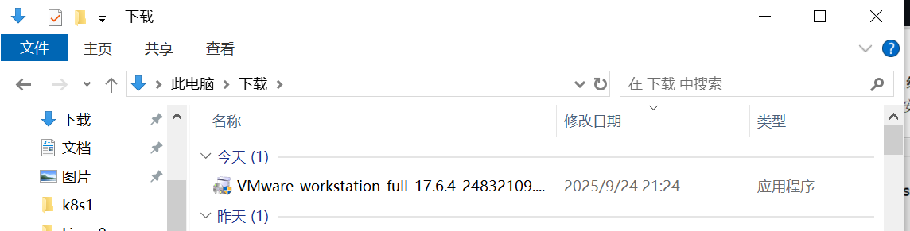
2. 下一步  
   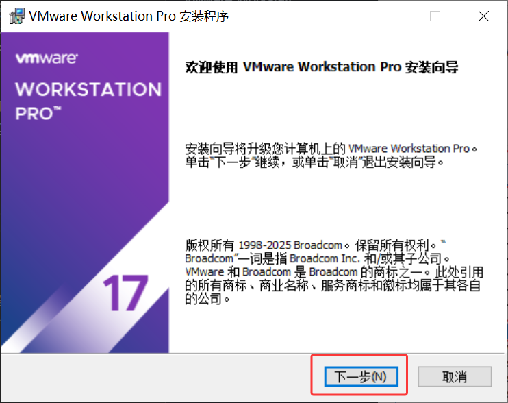
3. 同意协议  
   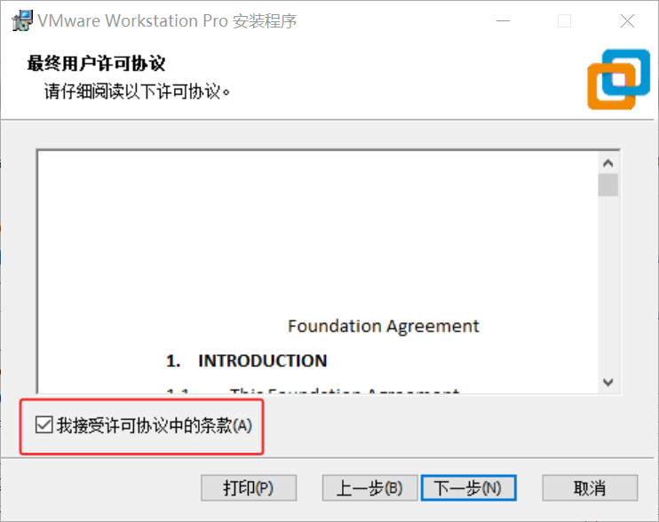
4. 修改安装位置，反正不要安装在C盘，如果你只有C盘就当我没说  
   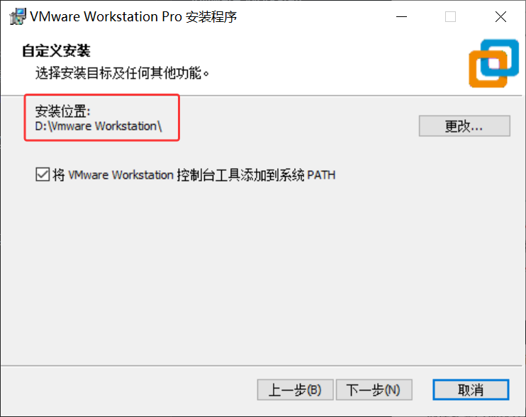
5. 强烈建议将两个 `√`都取消，但是如果你希望更新第一个不取消也没关系  
   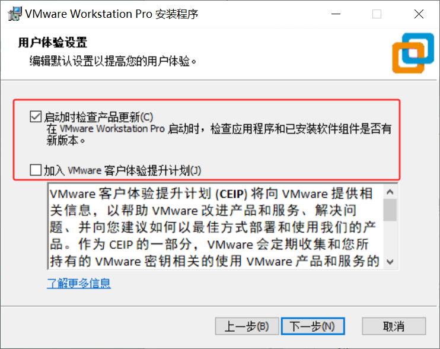
6. 下一步  
   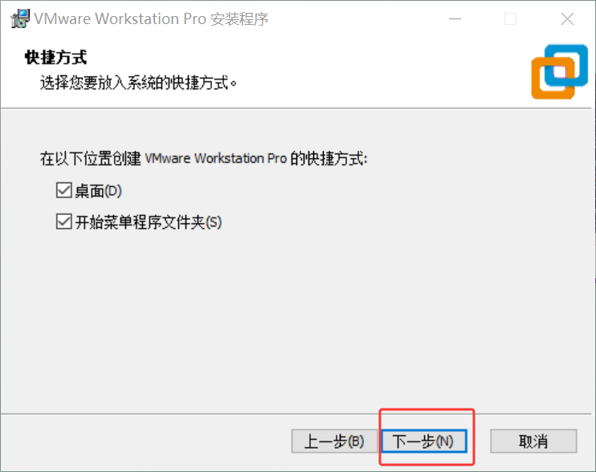
7. `安装`博主这里是之前已经安装好了，所以显示的升级  
   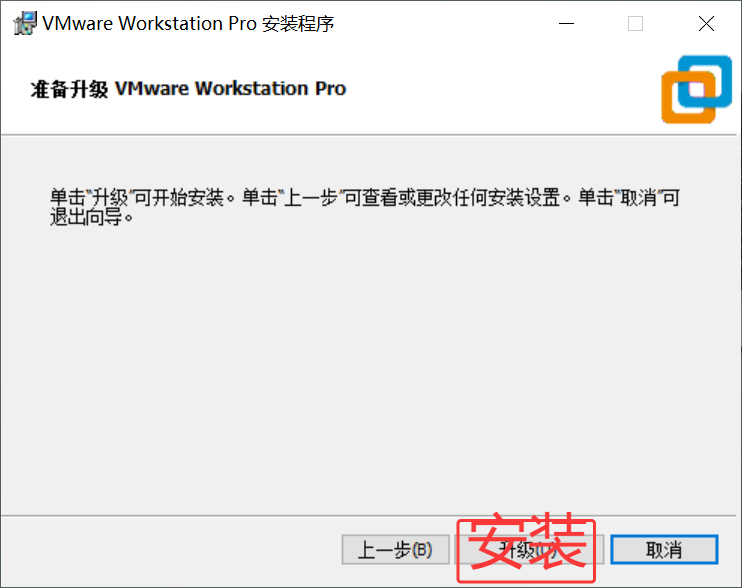

# 系统安装

## VMware配置

1. 打开刚刚安装好的VMware Workstation，你会看到下面界面，注意，你们没有红框框框起来的内容，我是有众多的集群实验环境，所以我这里有很多的虚拟机，但是你个刚刚安装好，所以不会有显示  
   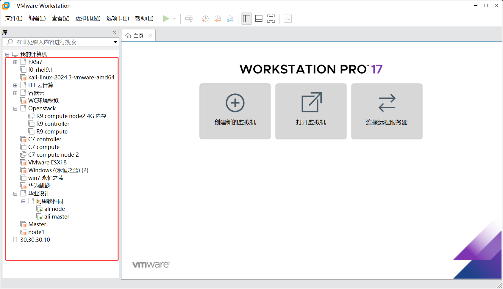
2. 点击左上角的 `文件`选项卡,在弹出的菜单中选择 `新建虚拟机`  
   
3. 会自动弹出 `新建虚拟机导向`窗口，你可以选择 `经典`直接跳转到第五步，教程中使用 `自定义(高级)`仅仅只是告知可以这么选择,选择完毕后点击 `下一步`  
   
4. 这里选择默认即可  
   
5. 这里我们选择 `稍后安装操作系统`，当然你也可以直接选择 `安装光驱映像文件`，然后将自己的ISO光驱路径填写在上面。路径是什么，路径就是文件在系统中的位置。你可选择后面的 `浏览`在新打开的窗口中选择刚刚下载好的 `Rocky-9.6-x86_64-dvd.iso` 并且跳转到8  
   
6. 选择系统类型，这里使用的最新的VMware，如果你使用的是老版本的可能会没有，可以选择RHEL9或RHEL8，为什么可以选择这RHEL系统，开头已经讲述的很清楚了。  
   
7. 选择完毕后点击 `确定`  
   
8. 修改名称和路径  
   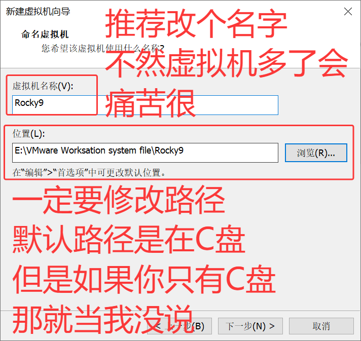
9.  默认即可，这里只是安装系统，做最基础的教学，所以设置为默认，但是如果你需要使用Linux做一下其他东西那么你可能需要更大的存储  
    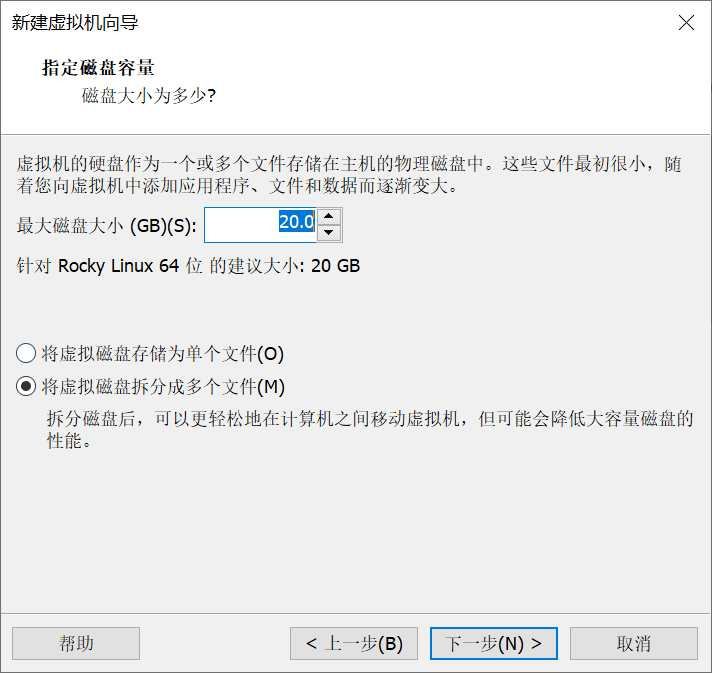
10. 默认即可，同理这里只是基础的教学实验，无需特殊硬件配置，所以无需要修改【如果你是使用的 `安装光驱映像文件`那么在这个界面的左下角会有一个 `创建后开启次虚拟机`，你可以勾选他，也可以不勾选。见下面图2】  
    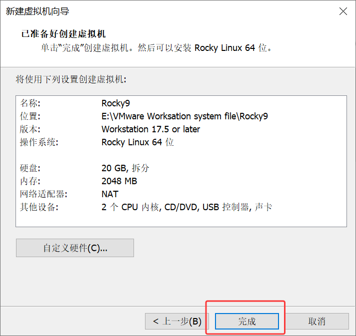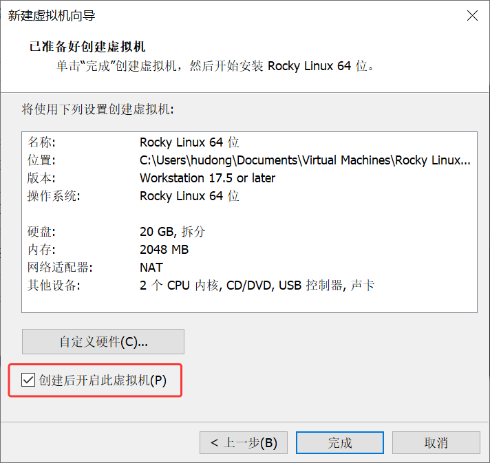
11. 上面步骤完成后你会看到下面界面的内容,绿色框表示可以虚拟机开关，上面的开关还有电源的效果，可以强制关机，黄色框表示硬件的基本信息，红色框表示可以编辑硬件的基本信息，假设你需要做k8s集群，需要4G内存，但是你忘记在刚刚修改虚拟机配置了，那么你可以在这里修改，蓝色框是和虚拟机快照相关的内容，快照在后面的课程中会非常有用。【如果你在前面选择的 `安装光驱映像文件`那么你可以直接启动虚拟机了，并且跳转到后一步 `系统安装`，但是如果你是和我一 `稍后安装操作系统`请继续按照我的步骤往下面看】
      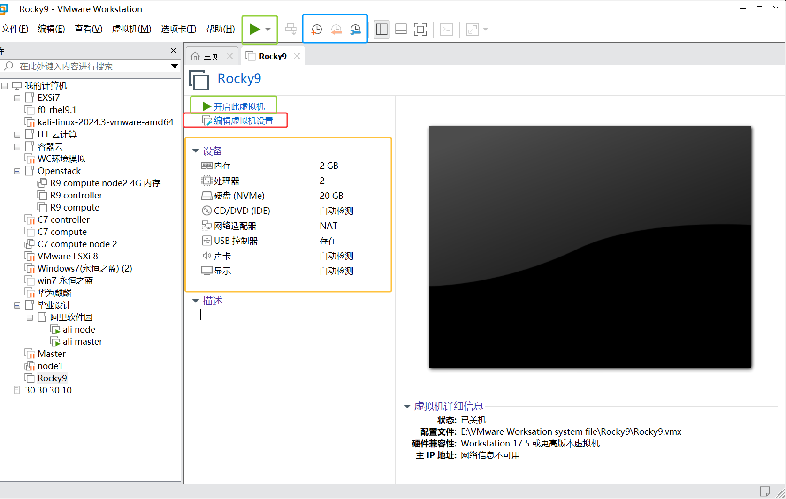
12. 这里选择红框 `编辑虚拟机设置`  
   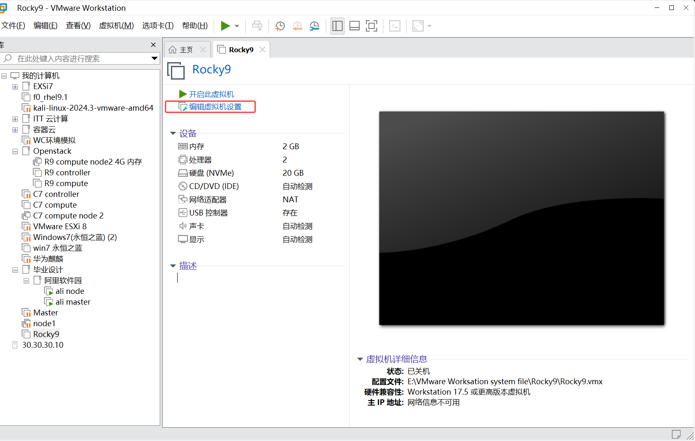
13. 在左侧，选择 `CD/DVD(IDE)`，在右侧选择 `使用iso映像文件`，选择后面的 `浏览`在新打开的窗口中选择刚刚下载好的 `Rocky-9.6-x86_64-dvd.iso`【为什么要使用这么麻烦的做法。这么做只是为了尽可能的演示VM，这篇文章的本意是教会更多人使用VMware和Linux,而不是为了“快”】
      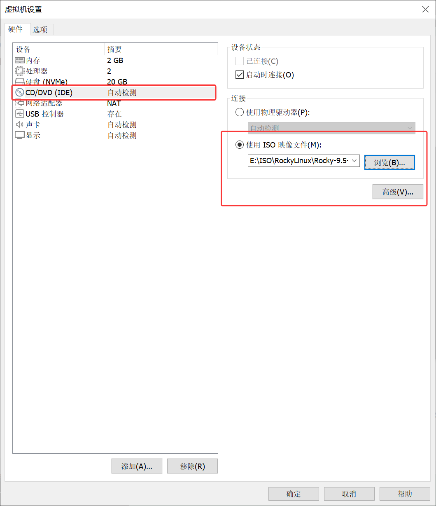
14. 开启虚拟机  
    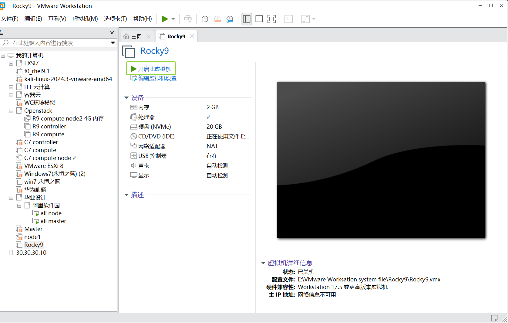

## 系统安装

1. 直接回车，推荐按方向键 `↑`键选择到 `Install Rocky Linux 9.6`，默认是 `Test this media & Install Rocky Linux 9.6` 检查映像并按照，检查的时间比较久，当然你直接会吃检查并安装也是一样的，没啥区别  
   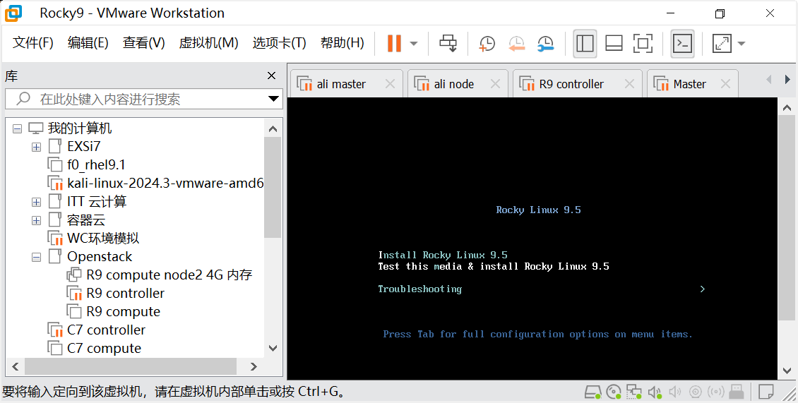
2. 这里选择中文，当然你选择英文也没关系，【一般情况下我选择的是英文，这里是为了演示选择了中文，选择中文在一些奇怪的地方会存在中文路径，在使用shell连接时存在中文路径，不是那么的方便，但不影响功能，不影响功能，不影响功能】  
   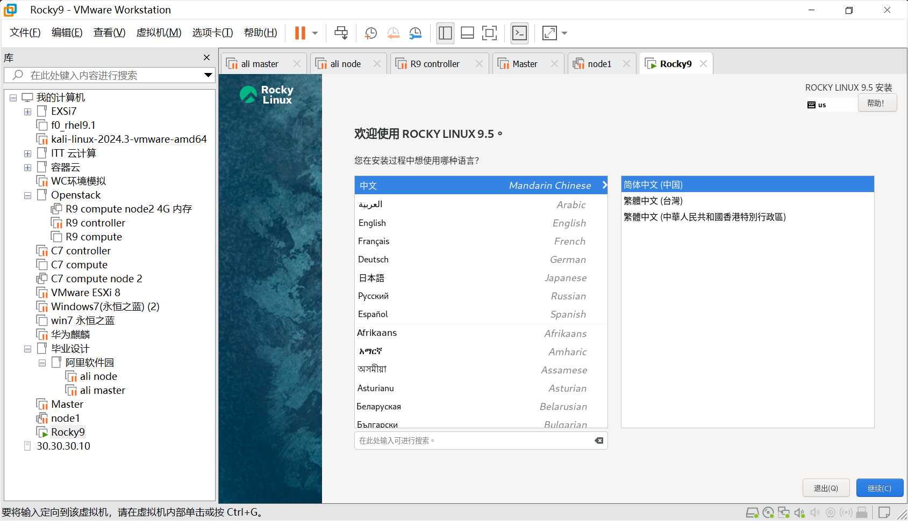
3. 我们需要完成下面红框选中的配置  
   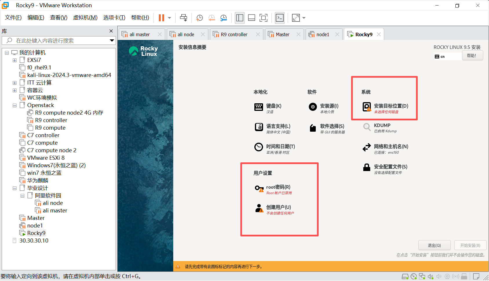
4. 这里选择 `安装目标位置`,完成后点击 `完成`【这里也可以选择自定义安装，自己配置分区，但我并不打算在这里教如何自定义分区，至少在你没学Linux系统目录结构和磁盘前我不会提这个知识点】  
   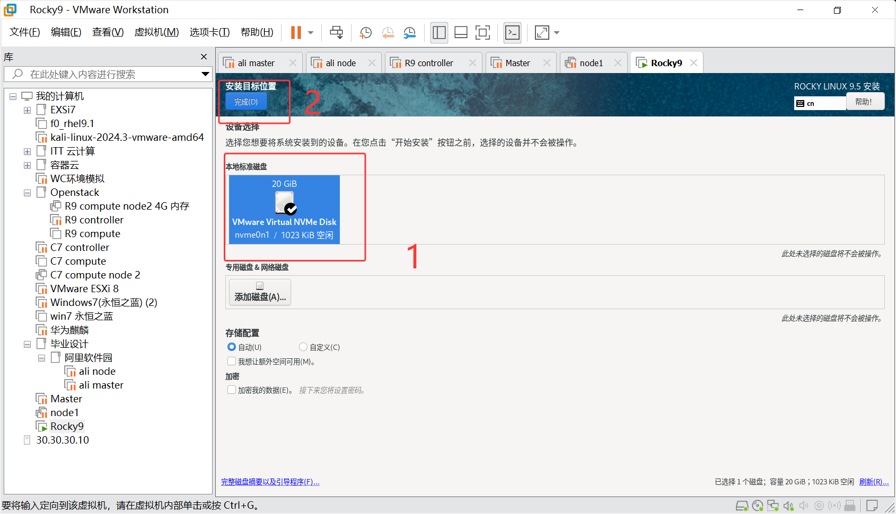
5. 回到界面会发现下面的红字已经没了  
   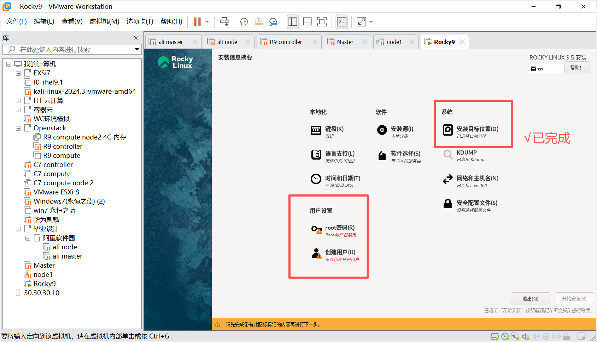
6. 然后我们选择Root密码，红框位必填,这里配置密码为000000【警告，严禁将次密码配置在生产环境中】。蓝框为选填，推荐将 `允许root用户使用密码使用ssh登入`【通用在生产环境中请谨慎勾选此选项】。配置完成后点击完成，但可能互没反应，这是因为我们配置的Root密码为000000，不符合最低安全要求，双机或三击 `完成`即可强制跳过，安全审审查【再次警告，严禁将次密码配置在生产环境中，如果在生产环境中这样配置后果自负】  
   
7. 回到完成后回到界面你会发现之前在在ROOT下面的 `创建用户`选项下面的红字没了，默认情况下，当设置了Root密码后系统不会强制要求创建用户；再然后你会看到我用蓝框选中了一个区域 `软件选择`。默认是使用GUI安装即，图形化界面进行的安装，但是在后面的实验环境中我都不推荐使用图像安装。  
   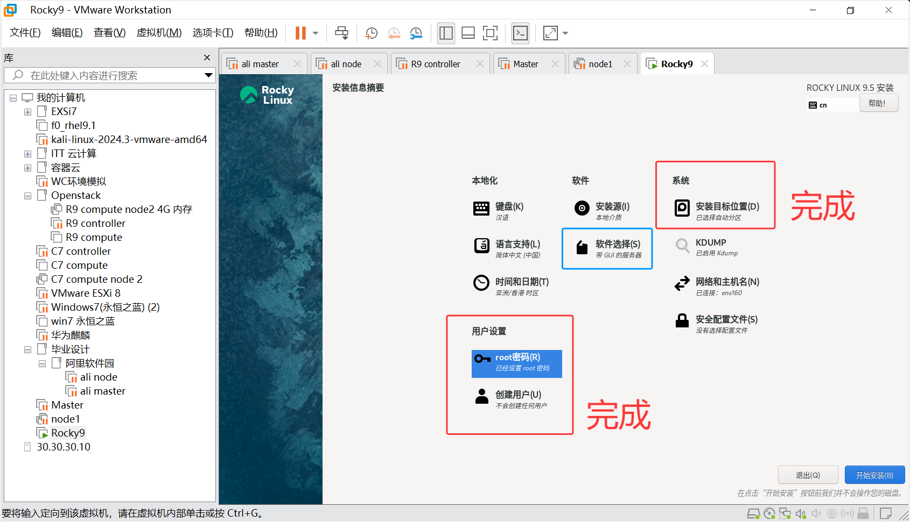
8. 这个张图就是 `软件选择`点开后的内容，默认为GUI安装，但等你能够熟练使用Linux后我会推荐你使用图中的标号1，最小安装，但是为什么这里选择GUI，是因为看这篇文章的都0基础的小白，如果你想知道最小安装是什么样子的你可以去看看我"小白都能学会的使用ansible快速搭建k8s集群【保姆级教程】"这篇文章，在最开始教安装的时候就是使用的英文+最小安装，如果你完全不会Linux基础，相信我，3秒劝退Linux。  
   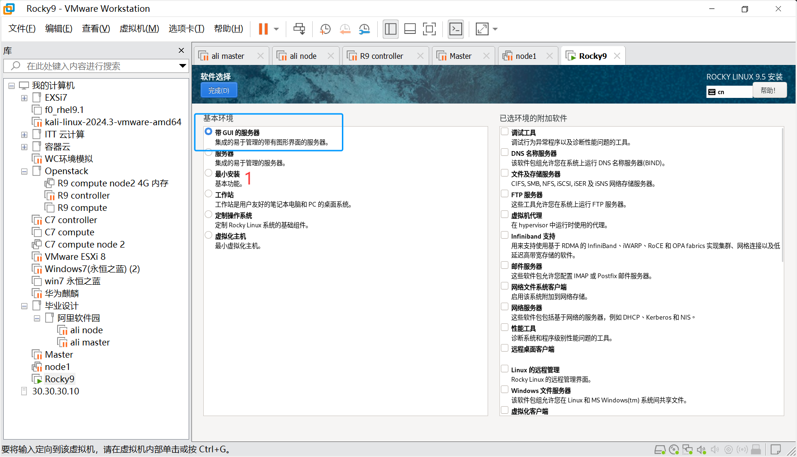
9.  这里回到上一个界面，点击右下角的开始安装  
   
10. 等等系统安装完毕  
    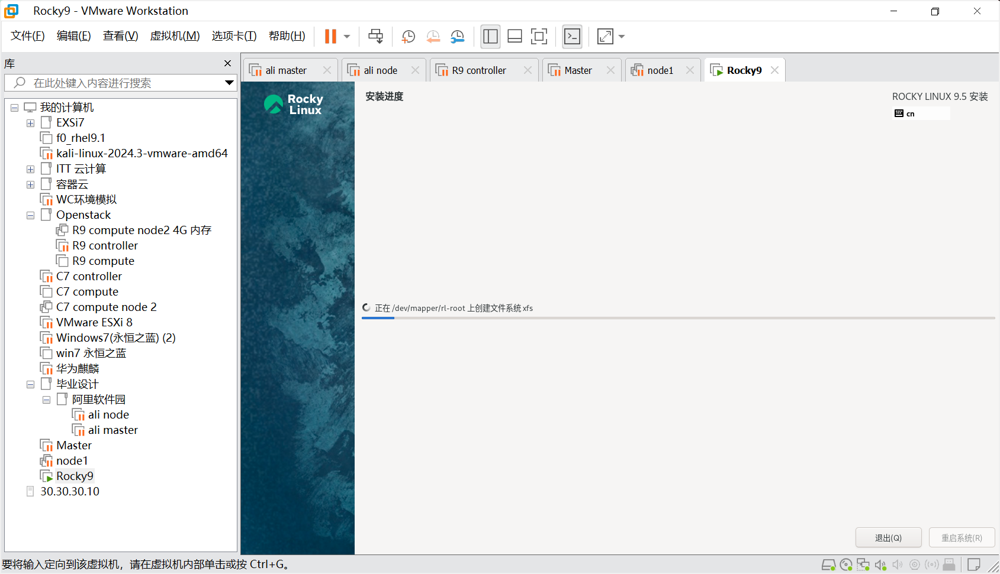
11. 系统安装完成后点击重启系统  
    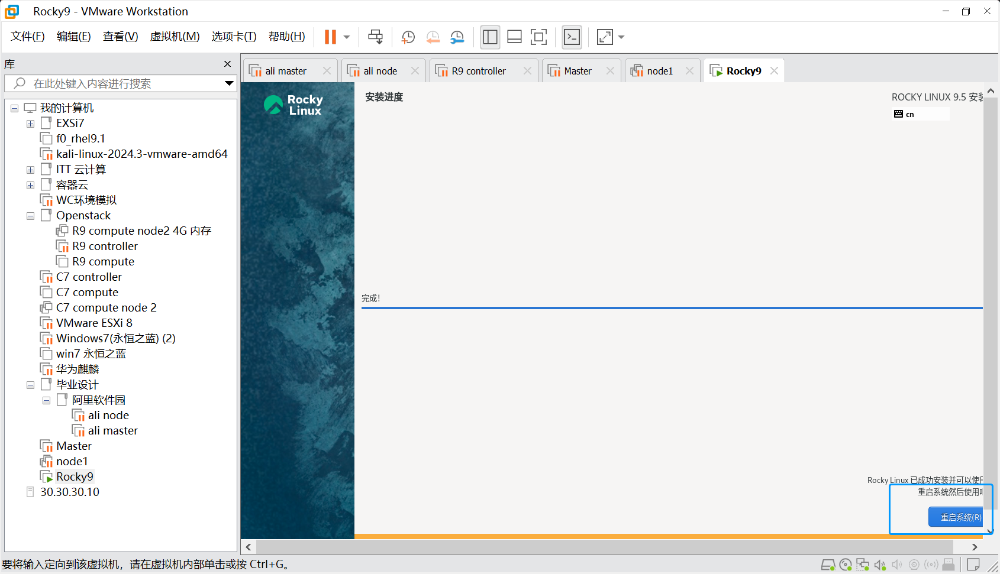
12. 重启完成后进入到下面界面，后面的内容随便设置，直到你看到下面一张图  
    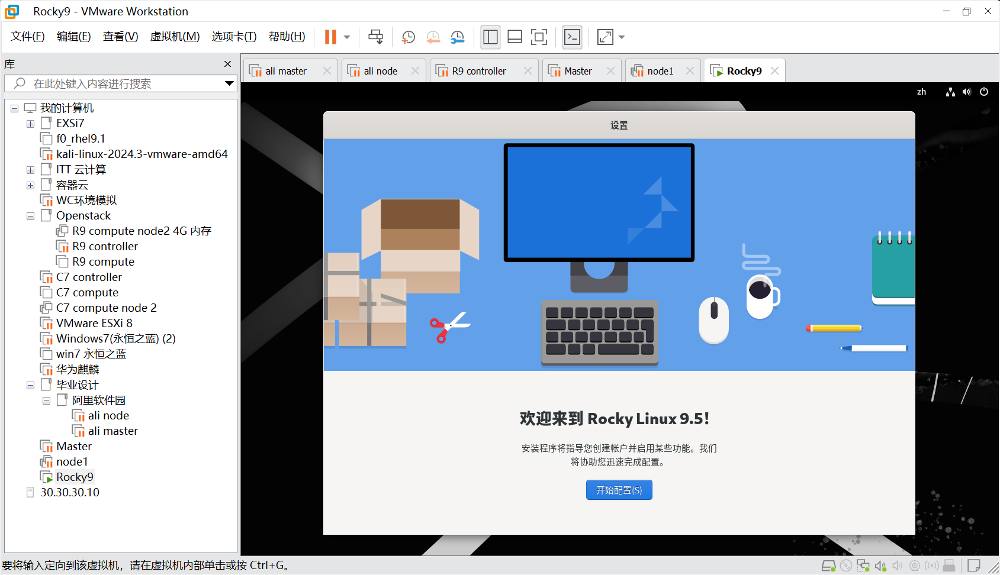
13. 这里就是图形化安装界面才会出现的一个问题，如果你前面使用的是最小安装那么你只需要设置一个Root用户即可无需使用创建用户选项，但是为了照顾小白使用的图形化安装，这里需要配置一个用户，我这里配置的用户名是user1,用户名可以随意配置，并没有什么大问题，配置完成后点击左上角的前进  
    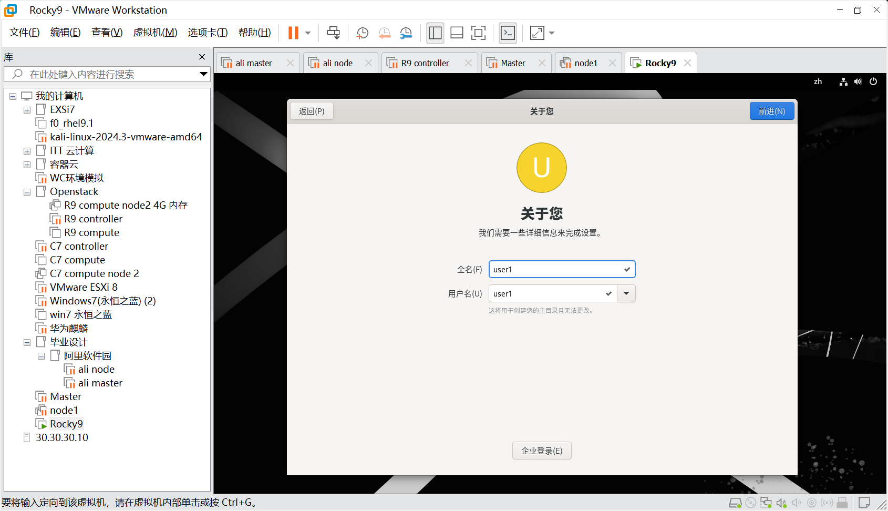
14. 这里需要配置一个复杂的密码，最低要求，长度大于8位，有英文和数字    
    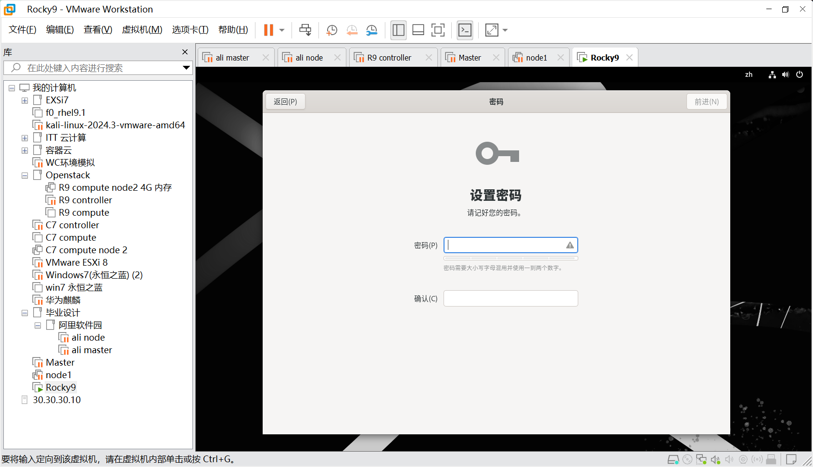
  
# 结尾
如果你看到这里表示你的Linux已经安装完成了，下篇文章我将会教你如何使用Linux，Linux命令基础，如何使用命令行完成像在windows中完成文件的移动，复制张贴查看。  
我在刚刚开始学Linux的时候，没有这样系统性的文章，他们只会告诉你这样做就可以了，至于为什么这么做文章没有说明，很多东西都是自己摸索，如果你觉得文章还不错的话你可点一个赞收藏或转发，如果你想继续学习Linux可以收藏这个专栏，这篇专栏中的所有文章都是面对0基础的Linux小白的，并且免费。之后的文章也会详细描述Linux的基础操作和配置，并且会尽可能的解释每一步这么做的原因，和参数细节。  