# Linux和RHEL
在上一篇文章中已经简单的介绍了一下Linux，这里再进行一点补充,Linux内核并不等于LInux发行版。Linux发行版是指以Linux内核开发的，将GNU工具，GUI环境打包发布的，发行版操作系统。比较知名的发行版有RHEL系列，RockyLinux，Centos；debian系列 Ubuntu这些都是Linux。而Linux是开源的。
# 发行版的基础目录结构
Linux的文件存放体系和Win不一样，Windows系统下存在磁盘"盘符"的概念，系统位于C盘，软件一般存放带D盘,每个盘符通常对应一个独立的物理磁盘或分区，但是Linux没有这个概念，Linux的目录结构是树形，即有一个树根`/`，`/`上有很多叶子/节点，每个节点又可以长出更多的叶子/挂载跟多的节点，以此类推。在Windows系统下假设我把C盘格式化了，那么Windows系统就崩了。Linux系统也一样，如果我班根节点删除或破坏了的话，那Linux系统也就崩溃了。  
Linux 文件系统层次结构标准定义了目录的用途和存放内容。市面上的LInux大多都遵循这样的目录结构，这里只是做完概念补充，了解即可
```
/
├── /bin/                 # 二进制可执行文件（用户命令）
│   ├── bash
├── /boot/                # 系统启动相关的文件（如内核、引导程序）
│   ├── vmlinuz-*         # Linux 内核文件
│   └── grub/             # GRUB 引导加载程序配置
├── /dev/                 # 设备文件（硬件设备在系统中的抽象）
│   ├── sda               # 第一块SATA/SCSI硬盘
│   ├── sda1              # 第一块硬盘的第一个分区
├── /etc/                 # 系统全局配置文件
├── /home/                # 普通用户的家目录
├── /lib/                 # 系统库文件（供 /bin 和 /sbin 中的程序使用）
├── /media/               # 可移动媒体的自动挂载点（如U盘、光盘）
├── /mnt/                 # 临时手动挂载文件系统的目录
├── /opt/                 # 可选的应用软件包（通常为第三方商业软件）
├── /proc/                # 虚拟文件系统，提供进程和内核信息接口
├── /root/                # 系统管理员（root）的家目录
├── /run/                 # 存放系统启动以来的运行时信息（如进程PID文件）
├── /sbin/                # 系统二进制文件（系统管理命令，通常需要root权限）
├── /srv/                 # 服务数据目录（存放特定服务提供的数据，如网站文件）
├── /sys/                 # 虚拟文件系统，用于与内核交互、配置硬件设备
├── /tmp/                 # 临时文件目录（所有用户可读写，重启后可能清空）
├── /usr/                 # 用户程序和数据（只读，可共享）
└── /var/                 # 可变数据文件（如日志、缓存、邮件）
    ├── cache/            # 应用程序缓存数据
    ├── lib/              # 可变状态信息（如数据库文件）
    └── www/              # Web网站根目录（常见位置）
```  

# Linux命令基础
首先我们要明白一点，Linux内核无法直接理解我们输入的命令。举一个不太恰当的例子：命令相当于中文，Linux内核相当于一个只懂英文的外国人，他们之间无法直接沟通，但当有沟通需求时怎么办？在现实生活中有翻译器，可以将中文翻译成英文。在Linux中也有一个类似的“翻译官”，叫做Shell（命令解析器），它负责将用户输入的命令“翻译”成内核能够理解的指令。Linux中有几种常见的命令解析器，例如bash，sh。  
Linux命令格式:  
```bash
command [options] [arguments]
```  
市面上几乎所有的系统都是遵循这套命令体系，RHEL，debian都是如此下面我会对格式参数进行详细解释:  
- command: 命令，表示你希望执行的操作，一般是指一个程序，这个程序一般位于`/bin`或 `/usr/bin`目录下
- options: 选项，一般以`-`开头表示，例如: `ls -a`列出当前目录下的全部文件，但options不是必要参数，他是可以省略的，例如`ls`列出当前目录下全部的文件和目录，ls命令后面会讲。
- arguments: 参数, 这里还是用ls举例，如果不加参数`ls`是列出当前目录下全部的文件和目录，但是如如果这时候我想看根目录下的文件和目录就可以添加参数`/`来达到效果例如`ls /`  
在明白了Linux的命令结构后下面将开始Linux命令教学，在教学开始前需要补充一点，你一定会好奇我们安装的都是GUI界面为什么要使用命令行操作，首先一点Linux的GUI并不“完善”，这里的不完善不是指基础功能，而是指后面会部署的一些Linux服务部署压根就不支持GUI，比如k8s集群环境，操作集群环境我们使用的是命令行工具kubectl,又比如安装软件，使用的命令RHEL系统的`dnf`,`yum`，Ubuntu的`apt`，他们可能有合适的图形化界面使用但是同样的，在使用图形化界面前我们使用命令行工具来安装他，如果你需要使用Linux系统，那么命令行就是必须要学会的，那为什么在安装的时候需选择了GUI界面，还是那句话，看这篇文章的都是新手小白，如果一上来就是命令行界面那么你应该已经劝退了。  
打开终端，终端就是我们输入命令的地方  
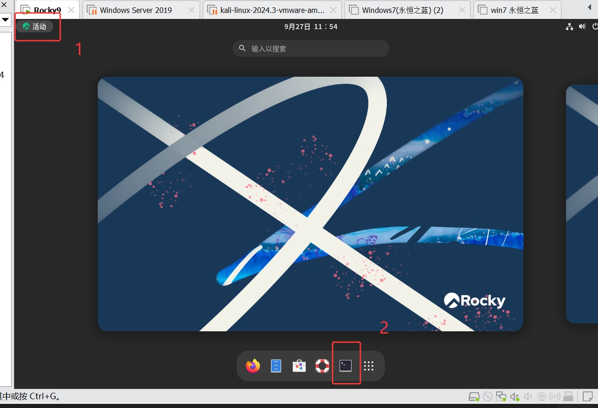  
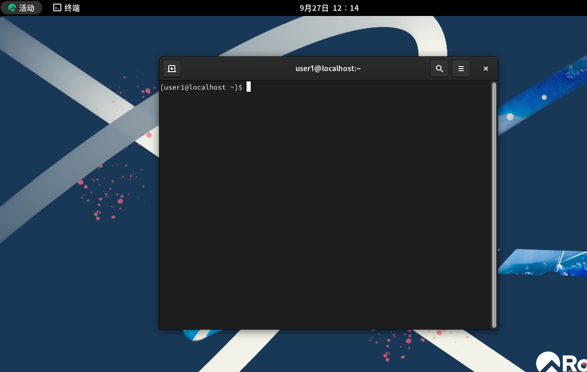  
打开终端后你会看到这么个东西  
```
[user1@localhost ~]$
```  
这就是Linux命令行，下面我来解释一下命令参数
- user1: 表示当前用户，我们是使用user1用户登入的，所以这里显示的是user1，如果我们使用的root用户登入的那么这里会显示`root@localhost`
- localhost: 表示主机命令，默认是`localhost`但可以使用命令修改，后面会讲
- ~ : `~`表示当前目录，`~`表示家目录，和家目录有关的内容等到后面将用户的时候再补全
- $ ：$表示当前是普通用户，如果是root超级管理员用户会显示为`#`

## 位置命令
### cd
在Windows系统先我想打开一个目录是直接双击目录的图标，但是在linux系统下我是使用命令完成操作,`cd`命令用于切换所在目录。  
命令格式:  
```bash
cd [目录路径]
```  
示例:  
```bash
cd /        #切换到根目录
cd /usr    #切换到根根下的usr目录
cd ~        #切换到家目录
cd ..       #切换到上级目录
cd          #cd后面不跟参数=cd ~
```  
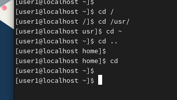  
### pwd
如果我想知道我现在是在什么目录下，Windows系统可以通过查看资源管理器地址栏的路径知晓。  
    
但是在linux系统下我们也同样需要通过命令知晓,`pwd`命令用于显示当前工作目录的完整路径
```shell
pwd
```  
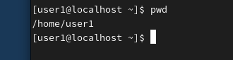    
## 查看命令
### ls
在Windows系统下查看目录中的文件，直接点开就可以了，但是命令行没有图像，所以我们也要使用命令来进行查看，`ls` 命令用于列出当前目录下的文件和子目录.  
命令格式:  
```bash
ls [选项] [参数]
```  
示例:  
```bash
ls      #列出当前目录下的文件和目录。
ls -a   #列出当前目录下的所有文件和目录，包括以.开头的隐藏文件。
ls -l   #以详细列表方式显示当前目录下的文件和目录，这个命令有一个别名 ll
ls /    #列出根目录 / 下的文件和目录
ls ..   #列出上一级目录下的文件和目录
```  
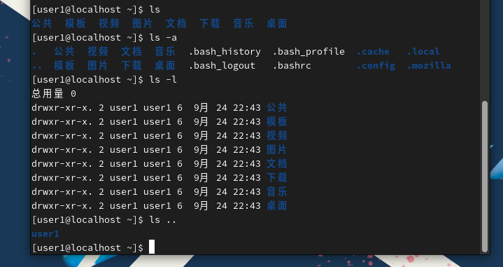   
### cat
在Windows系统重，我们要是想查看一个文件一般是点开打开文件进行查看，但是在Linux中依然是使用命令`cat`查看，**知识点补充: 在Windows系会使用文件后缀来区分文件类型，在Linux系统重没有文件后缀，cat可以直接查看，Linux中的文件名后缀是个人或程序看的**  
命令格式:  
```shell
cat [文件路径]
```  
示例:  
```shell
cat .bash_profile 
```  
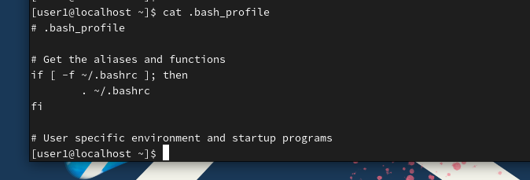  
### tail
linux中不仅可以使用cat查看整个文件的内容，可以使用`tail`命令查看文件末尾的几行内容，默认显示文件最后10行。  
命令格式:  
```bash
tail [选项] [文件路径]
```  
常用选项:  
-n <行数>: 指定显示文件的最后几行  
```shell
tail .bash_profile 
tail -n 3 .bash_profile 
```  
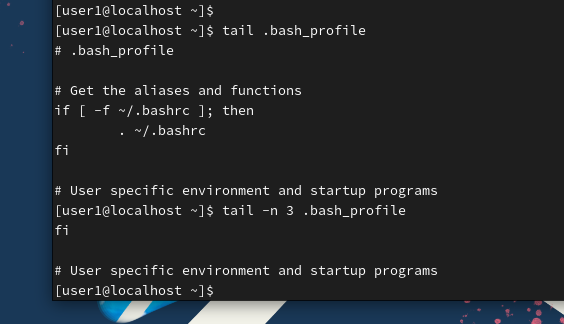  
### head
linux中可以使用`head`命令，查看文件开头的内容。默认显示文件开头10行。  
命令格式:  
```bash
head [选项] [文件路径]
```  
常用选项:  
-n <行数>: 指定显示文件的最后几行  
```shell
head .bash_profile 
head -n 3 .bash_profile 
```  
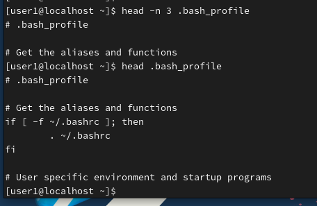 
### less
在linux中使用`cat`命令查看长内容文本并不是很方便，这是就可以使用`less`命令了，打开文件后可以使用键盘上`PgUP`和`PgDown`实现快速翻页
命令格式:  
```bash
less [选项] [文件名]
```
常用选项：  
-N 显示行号  
-i 忽略搜索时的大小写  
示例:  
```bash
less -N /etc/passwd
```  
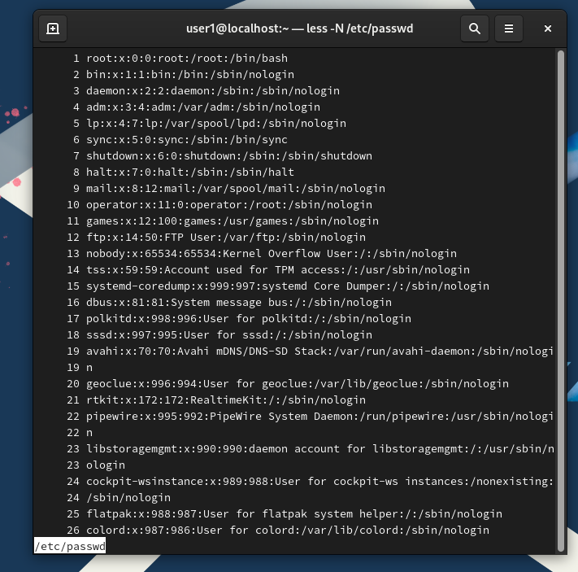 
## 创建命令
### mkdir
在Windows系统中新建文件夹，只需要鼠标右键，新建>新建文件夹即可完成创建，但在Linux中需要使用命令`mkdir`,`mkdir`命令用于创建新的目录。  
命令格式:  
```bash
mkdir [选项] [目录名]
```  
常用选项:
-p: 递归创建目录，如果父目录不存在则一并创建  
示例:  
```bash
mkdir new1               # 在当前目录下创建名为new1的目录
mkdir /tmp/test          # 在/tmp目录下创建test目录
mkdir -p a/b/c           # 递归创建a/b/c目录结构，如果a或b不存在会自动创建
```  
  
### touch
在Windows中新建文件需要选择新建什么类型的文件是txt文本文件还是world文件，但是在Linux中没有这样说法，前已经说过了，直接使用命令`touch`  
命令格式:  
```bash
touch [文件名]
```  
示例:  
```bash
touch newfile.txt         # 创建名为newfile.txt的空文件
touch file1 file2 file3   # 同时创建多个空文件
```  
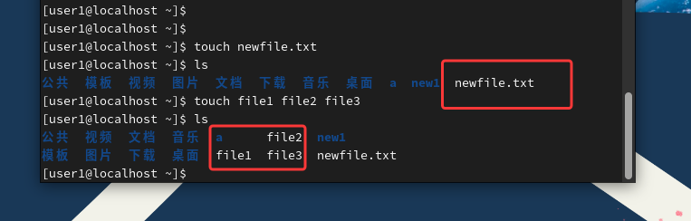  
## 删除命令
### rm
在Windows中删除文件是先选中文件然后右键删除或者直接按键盘上的delete键，但是在linux中删除文件使用命令`rm`  
命令格式:  
```bash
rm [选项] [文件或目录名]
```  
常用选项:  
-r: 递归删除目录及其内容  
-f: 强制删除，不提示确认  
示例:  
```bash
rm file1
rm -f file2
rm -r new1
rm -rf a
```  
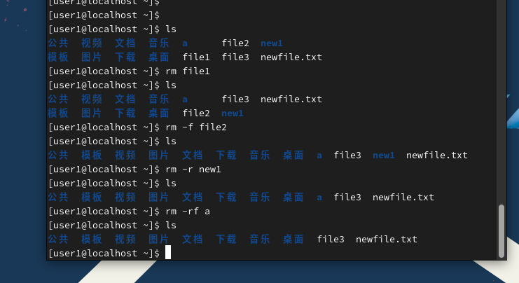  
## 复制，移动，重命名
### cp 
在Windows系统中复制文件，通常需要右键点击文件选择"复制"，然后在目标位置右键选择"粘贴"。在Linux中需要使用命令cp，cp命令用于复制文件或目录。  
命令格式:  
```bash
cp [选项] [源文件或目录] [目标文件或目录]
```  
常用选项:  
-r: 递归复制目录及其所有内容  
-i: 覆盖前提示确认  
-f: 强制覆盖，不提示确认  
-v: 显示复制过程的详细信息  
示例:  
```bash
cp /etc/passwd /tmp/
```  
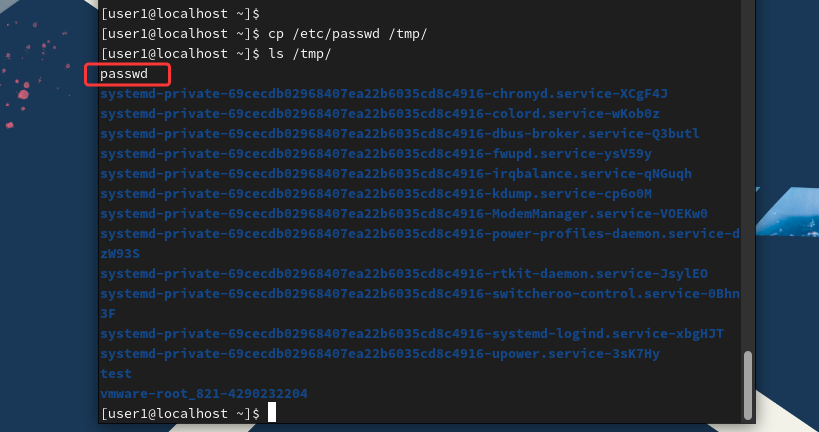  
### mv
在Windows系统中移动文件可以通过拖拽或剪切粘贴完成，重命名则是右键选择"重命名"。在Linux中统一使用mv命令，它既可以移动文件/目录，也可以进行重命名  
命令格式:
```bash
mv [选项] [源文件或目录] [目标文件或目录]
```  
常用选项:  
-i: 覆盖前提示确认  
-f: 强制移动，覆盖时不提示  
-v: 显示移动过程的详细信息  
示例:  
```bash
mv /tmp/passwd /home/user1/
```  
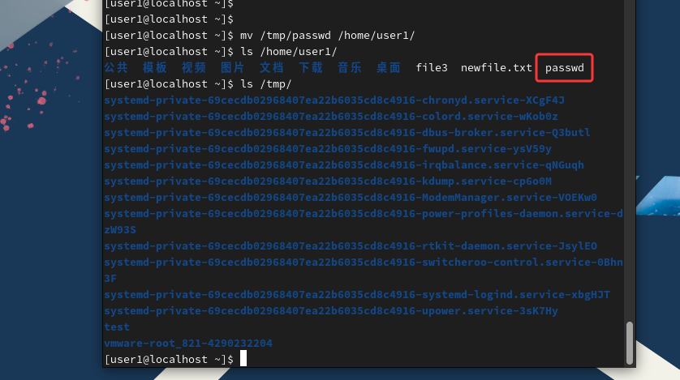  

## 帮助命令
如果在使用命令的时候忘记了命令的选项或者参数如何填写可以在命令后面使用`--help`选项来查看帮助信息。  
示例：  
```bash
cd --help
```
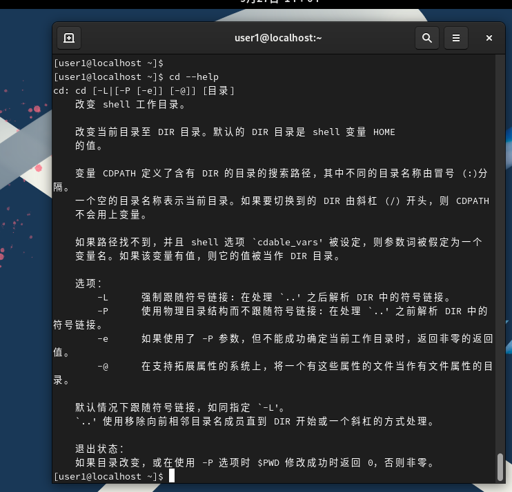  
### man
如果你想获取更加详细的命令信息可以使用`man`命令进行查看。  
命令格式:  
```bash
man [命令名称]
```  
示例:  
```bash
man cd
```  
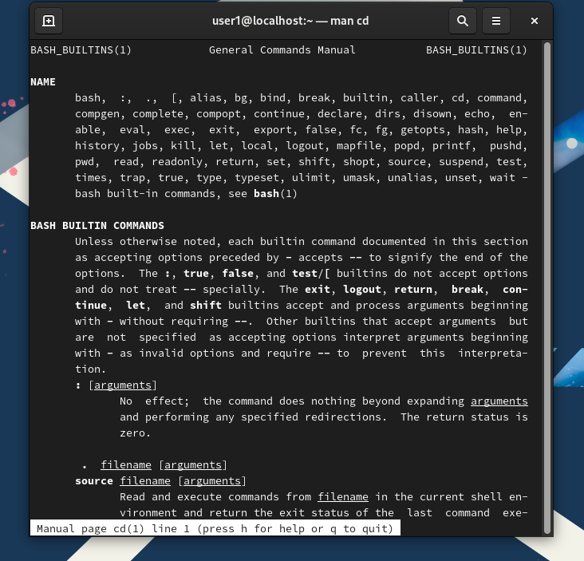 
# 结尾
很高兴你能看到这里，这一篇讲述的是Linux基础命令，也是在Linux日常操作中使用平次的最多的命令，这些命令不需要刻意去背诵记忆，实践是最好的背诵。下一篇文章我将会讲述世界上最流行的编辑器vi/vim编辑器，使用vim编辑器的人不仅仅局限于linux，许多的开发者也会在VScode，Visual Studio，IDEA中使用vi/vim插件来进行vim模拟操作，由此可见vim编辑器的强大。