# 前言
vim编辑器的强大之处在于你在编辑文本的时候双手几乎不用离开键盘就可以完成文本的编辑，并且使用不同的快捷键达成不同的效果，但是对于习惯使用键鼠+GUI编辑文本的人来说，一下子需要适应完全键盘的编辑模式，实属有些许困难，这篇文章我会尽量的将vim中的操作和在windows中的操作对照讲解，希望能够帮助你更快速的理解。【如果是是按照我步骤安装的你的系统上会有vim编辑器，但是如果不是按照我的步骤来的，或者在你输入vim的时候提示没有找到命令就是说明你的系统没有vim编辑器，需要安装，安装的需要等到我后面讲RPM包管理的时候才会交你安装，现阶段你可先看此位置，并且使用vi编辑器，如果没有vim编辑那一定会有vi编辑器，除非你用的不是RHEL系列的系统】  

# vi和vim
vi和vim是两个不同的编辑器，vi编辑器是Unix系统上一个屏幕文本编辑器，而vim则是在vi编辑器的增强版，所以大大多数的情况下vi和vim的操作是通用的。而且有一些服务器默认情况下并不会安装vim，而是使用的传统的vi编辑器，而vim则需用使用yum或dnf命令进行安装。  
这边提一嘴，本篇文件会相对系统性的讲述vim编辑器，但是系统性的vim教学已经超出了红帽RHCSA的授课范畴，至少我在备考红帽RHCSA的时候vim只是提了两嘴，所以这里提供一个省流版本，见文章最后【vim省流版】  
*本文内容根据vim编辑器的官方编写而来，目的是尽可能教会读者尽可能高效的使用vim,而不是完完全全的将官方文档中的内容简洁摘要出来，如果你感兴趣向看看官方的说明书，可以前往下面链接[vim doc](https://vimhelp.org/)，这里很感谢[yianwillis](https://github.com/yianwillis)提供了汉化后的[vim docs文档](https://yianwillis.github.io/vimcdoc/doc/usr_toc.html)*

# vim模式
在大多数的教材中，vim编辑器只有三种模式，包括本文章最后的省流版中编写的也是三种模式，但其实vim编辑器有四种模式，普通模式，编辑模式，末行模式，可视模式。下面我会使用word来进行类比,尽可能的带各位理解各种模式。  
- 普通模式: 他像一个开了保护的word文档，我们无法对他添加任何内容，这里的添加是特指使用键盘编辑文本。  
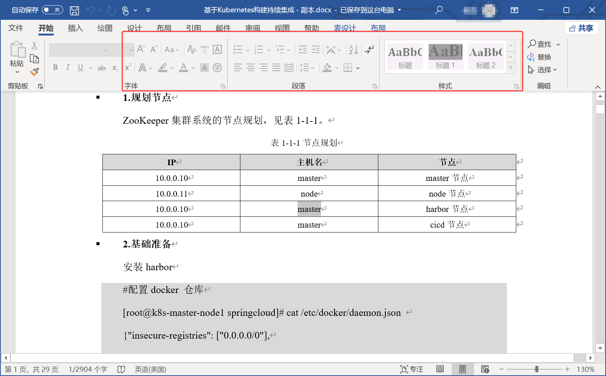  
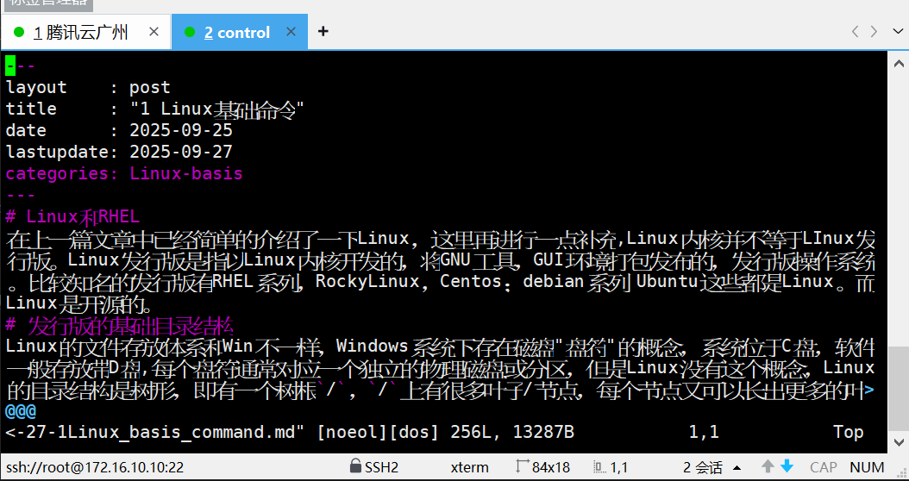  
- 编辑模式: 解除了保护的word，我们可以在这里编辑文字,并且左下角会有一个`INSERT`的表示，则时候就表示。  
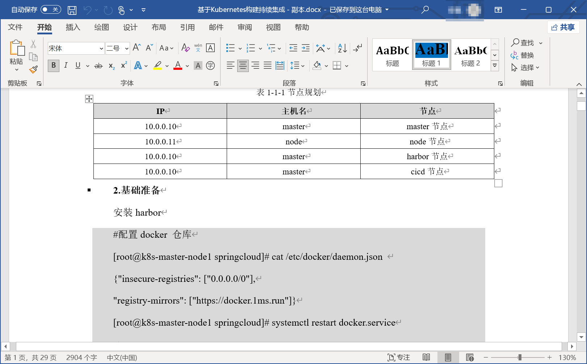  
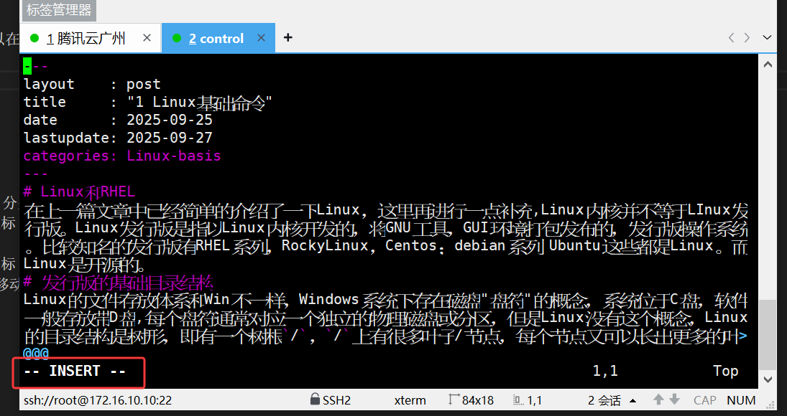  
- 末行模式: 很遗憾在win系统下,并没有这样类似的概念，你可以理解为word+CMD ?,在末行模式中你没办法编辑文本，或者移动行号，只能输入一下命令，来达成实现某些效果。表示在末行会有`:+光标`提示，所以叫做末行模式  
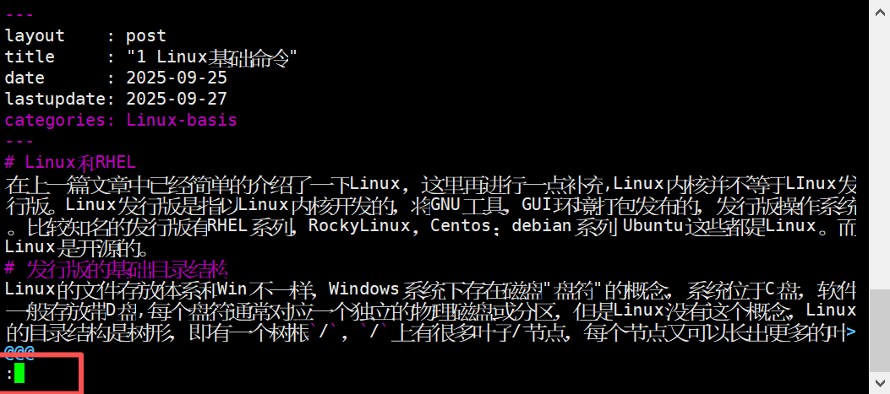  
- 可视模式: 这个模式很少被提及，因为在日常的运维之中这个会用到这个模式的地方太少了【至少在我考完RHCSA后2年内我是压根都不知道这个模式的】，你可以理解为选中。在win中，我们选择是靠鼠标实现的，但是在vim中我们是没有鼠标的，那我们要怎么选择一段内容呢？就是靠可视模式。    
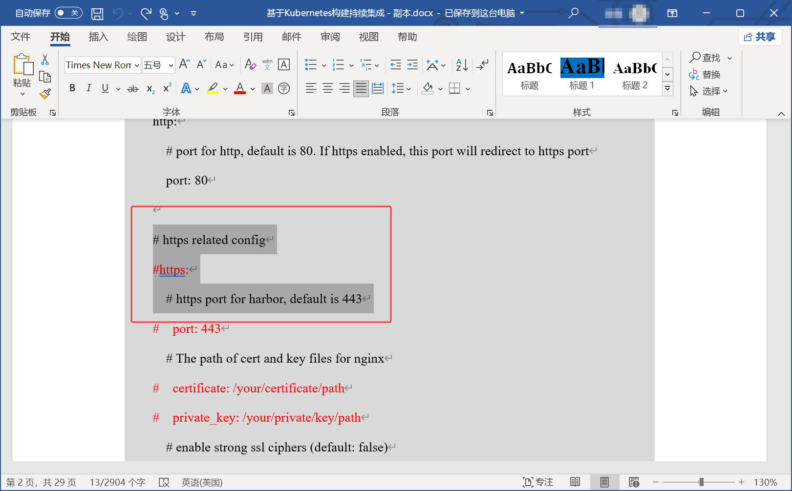  
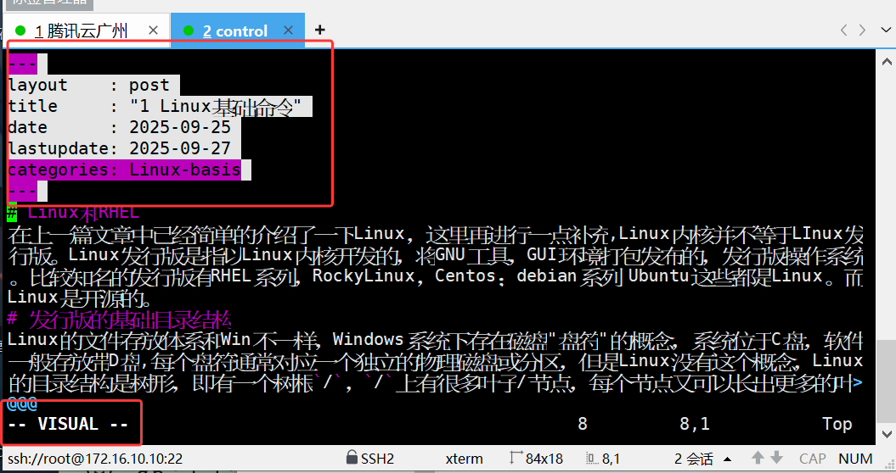  
这里关于视图的介绍先仅作为概念了解即可，有关视图的切换的操作到后面会配置vim的操作一并提及。  
# vim操作
操作vim的第一步就是打开vim  
命令格式:  
```bash
vim [文件名称]
```  
如果这个文件存在则会进入到编辑模式，不存在会自动创建一个，不论文件是否存在，只要进入到vim中就一定是`普通模式`  
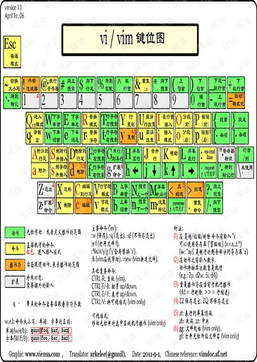  
如果你看到这张图一定会会觉得头脑发昏，对VIM心生退意，但请不要着急，后面的内容我会将vim的步骤一一拆解。  
## 编辑模式
在大家使用命令进入到vim编辑器中是的时候，应该都是空文本吧，我演示用使用了我在介绍命令的时候使用了一些实例文件，请注意这些都是系统文件，只是做示例演示给大家，没有对文件内容进行任何修改，建议大家使用`vim test.txt`命令创建一个文件继续下面内容。  
进入后大家都是空白界面，如果是新文件就出现下图中红框选中的提示，如果没有那么久表示你这样问已经是被创建了的，可能是系统生成也可能是使用`touch`命令创建的，这个只有你自己知道，再强调一点，只用不是使用`/etc`目录下面的文件做实验问题不大。  
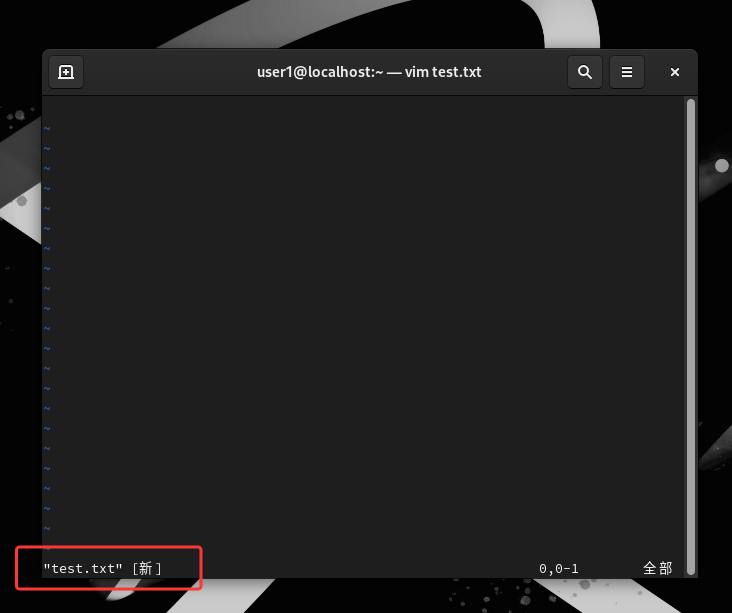  
使用`i`进入编辑模式，这样你就可以输入文字了，和你在空白word中差不多，文字输入完成后按`<esc>`键回到普通模式。文章下面的内容都在普通模式模式里面展开。我们处理使用`i`键进入编辑模式外，也可以使用`a`,`o`进入编辑模式，`i`表示在当前光标前面开始输入，`a`表示在当前光标后开始输入，如果你在普通模式按`a`你会发现，你在进入到编辑模式的同时光标往后移动了一个字符，如果这一行没有任何内容那么`i`,`a`的效果是一样的。`o`表示在进入到编辑模式后，新建一行并且将光标移动到新的一行。
### 替换模式
编辑模式有种子模式，一种是默认的插入模式，林外一种是替换模式。假如我在"AB"中级插入“123”插入模式的结果是"A123B",而替换模式的结果是"A123"。这个模式用的很少所以这里只是提一嘴。在普通模式下使用大写`R`键进入，`<esc>`退出，使用`<Insert>`键可以实现两个子模式的切换。  
## 普通模式
### 移动
在word中我们移动光标位置都是直接使用鼠标点击到目标位置，但是在vim中，我们只能使用键盘，进行光标移动。  
在vim中除开最基本的使用上下左右方向键进行。  
```
  k
h    l
  j
```  
这时候你一定发现了，如果一个字一个字的移动，向移动一个词不知道要多久，这时候就可以在普通模式下使用`w`,`b`，`w`表示向前移动一个词，`b`表示往后移动一个词。  
及时是这样你也肯定觉得慢，假如我要将光标一次性移动到行尾，要怎么办，键盘上有一个键可以实现一键移动到行尾`<end>`，但是如果你是跟我一样的短键盘没有`<end>`键位，也可以在键盘上按`$`键实现，移动到行首`<home>`也可以使用`^`键实现同样的效果。  
  
刚刚我讲了光标在一行内的移动方式，下面来了解一下行移动，在行与行直接移动可以使用`k`,`j`,`↑`,`↓`。还可以使用`gg`移动到第一行，`G`移动到最后一行。如果这是我要移动到中间行,或者只往下移动几行那我要怎么做。这里可以补充一个小技巧，Nj,Nk,这里的N表示数字，3j表示往下移动3行，5k表示往上移动5行，4w表示往后移动4个单词，  
  
关于在编辑模式下移动光标，在编辑模式下无法使用hjkl进行光标的移动，所以要不使用`<esc>`键回到普通模式,或者使用`上下左右`方向键移动光标。  
  
### 翻页
在word中我们翻页一般直接使用鼠标滚轮，往下一滚就可以了，但是在vim中我们依然需要通过键盘实现，同样键盘上有个按键一样可以实现翻页的效果`<PgUp>`,`<PgDown>`,但是我没有这个按键要怎么做，这里可以使用`CRTL+U`,`CTRL+D`,实现一样的效果。  

### 查找
在word中我们使用查找都是CTRL+F,输入查找内容。即可，但是使用vim查找会稍微麻烦点，`fX`,这里的X表示要查找的字母，对X他是一个字母，不是一个单词，而且只能查找在这一行中的内容，如果这时候你刚好在使用vim编辑你一定发现了，fX可以用于位移，没错是的，fx在官方文档中是被用在位移中的，官方文档中对`f`的定义是 *在行内查找并跳转到字符* ，只是我觉得`f`写在查找稍微更合适点。`f`查找只能查找一个字母，而且还是仅在这一行中，如果我要查找一个词那要怎么办？  
这时就可以使用`/`，`?`查找了，这两种方案有什么区别吗？答案没啥区别，都是`/`，`?`后面接查找字，按`N`寻找下一个，`/`是往后查找，`?`是往前查找。`/`查找到最后会回到文章头，`?`回回到文章尾  
如果你觉得vim的查找功能就这样那就太天真了，vim支持使用正则表达式进行查找，这里只是对正则表达式进行简单的距离，如果想了解跟多可以查阅官方文件usr_27.txt。   
1. 使用`^`进行首行匹配，`/include`会将全文的"include"标记出来，但是如果是`/^include`则只有行开始的第一个"include"会被标记出来，其他的"include"不会显示
2. 使用`$`进行尾行匹配，`/the$`只会将行最尾的"the"进行高光亮显示。
3. 使用`.`可以表示任意字符，假如我要查找the，但是我只记得t什么什么e，那么这时候我就可以使用`t.e`来进行查找，他会将全文所有和这个有关的全部进行高亮包括"the","t1e","tTe"等等
4. 使用`\`匹配特殊字符，假设我需要找一个"the."的内容，但是"."在vim中表示通配符，如果这样找高亮的内容可能是"thea"，"then"等，那么这时候就可以使用`\`来转义一下`the\.`那么这时候高亮的内容就是"the."  
我知道你在想什么,如果我这样输通配符`/^the$`会怎么怎么样，答案就是他只会匹配这一行只有the的内容，你可以自己尝试一下。  

### 删除
在word中如果我们要删除字符，是先用鼠标点到需要删除的位置，使用delete键或backspace（退格键）来进行文本的删除。但是vim中情况不是那么的一致，我前面说了在`普通模式`下我们无法对文本内容进行编辑，并且特指了键盘输入文本，不一致的情况就是在这里，在`普通模式`下我们无法使用backspace删除内容，如果你尝试删除你只会看到光标在往前走，而内容并没有被实际的删除，**但是**，在普通模式下我们可以使用`x`和`<delete>`键将文本删除，`x`和`<delete>`功能是一样的，但是他们都只能删除光标所在的字符，如果我需要更快速的删除其他东西要怎么做。    
这里就需要引入一个操作符`d`,操作符你可以理解为他是一个动作，表示删除，前面已经说了`w`表示前进一个单词，`d`表示删除，`dw`表示删除一个单词，`d4w`表示删除往后的4个单词，`$`表示行尾，那`d$`就表示从光标所在处开始删除一直到行尾，`d^`表示从行首（这一行的第一个字符）开始删除到光标所在处。而`dd`则表示删除这一行，`5dd`表示删除往后5行，包括光标所在行。  
### 撤销与恢复
现在你已经学会了vim的大部分操作了，如果这时候你在删除文件多余内容不小心删多了要怎么恢复，在Windows下我们都是习惯CTRL+z进行恢复，但是在vim并不是使用CTRL+z而是使用`u`键undo。  
现在你使用u键将误删的内容撤销了，但你又一不小心多按了几个`u`将原本需要删除的内容恢复了，这时候就可以使用`CTRL+r`进行回复，和word中的CTRL+Y功能一样。如下图。  
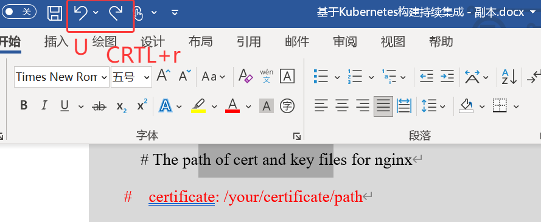  
## 末行模式
到此普通模式下的常用操作基本上都讲解完毕了，后面可能还会有一些补充，但是先不急，这里我先将和末行模式有关的知识点写完，末行模式，前面已经讲过了，就是在最尾行的模式，用于输入命令。使用`:`键进入。  
我知道大家最关心的问题是怎么保存怎么退出，保存的命令是`w`即写入保存，退出`q`，保存退出`wq`或`x`,`!`表示强制，那么不保存退出就是`q!`强制退出，如果你修改了文件使用`q`退出会提示E37。    
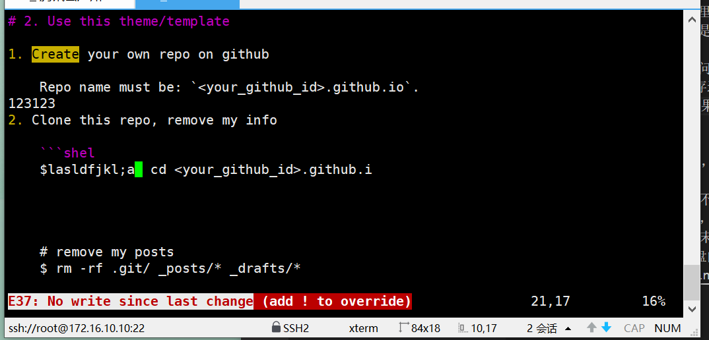  

### 替换
在word中我可以使用查找功能将查找到的内容进行替换，vim也有，但是和word不同之处在于，vim的替换是通过命令进行，也就是我刚刚说的末行模式。  
命令格式【已经进入末行模式】:  
```vim
[range范围]substitute/原内容/目标内容/[flags标志]
```  
**标准的命令格式很少有人写下了，因为`substitute`太长了，我们一般简写为`s`**  
`range范围`表示在文章中多大的范围域进行查找，“范围域”在后面会单独进行详细的讲解，这里只需要记住`%`表示作用于全部。  
`flags标志`你可以将后面的标志理解为"替换的动作"。什么叫"替换的动作"，在word中存在替换下一个，和全部替换等多个选项，这些在vim编辑器中也是存在的，如果我想进行全部替换flags标志位为`g`,如果你想一个一个查找替换你可以将flags写为`c`你在替换的时候出出现下面提示。  
```
replace with {目标内容} (y/n/a/q/l/^E/^Y)?
```
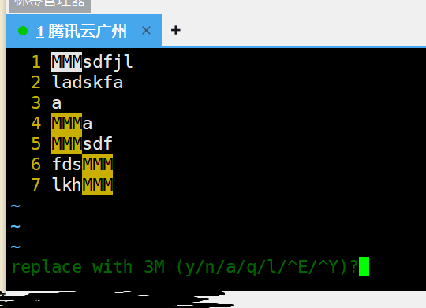  
- y: Yes，是；执行替换
- n: No，否；跳过
- a: All，全部；对剩下的匹配点全部执行替换，不需要再确认
- q: Quit，退出；不再执行任何替换
- l: Last，最后；替换完当前匹配点后退出
- CTRL-E: 向上滚动一行
- CTRL-Y: 向下滚动一行
例如我要将全文的MMM替换成3M命令格式如下:【在末行模式下】  
```vim
%s/MMM/3M/g
```  
#### 范围域/命令范围
范围域就是选中的范围，因为在vim中我们没有鼠标来选中，所以这里需要使用到命令行来进行选中。  
我们可以使用`N,N`来表示一段范围，N表示数字，下面表示替换1到5行，包括第5行的MMM  
```vim
1,5s/MMM/3M/g
```  
我们也可以使用N来当度指定替换哪一行。值替换第三行中的MMM  
```vim
3s/MMM/3M/g
```  
  
更加精确的范围域:  
假设你在编写一本书，你想把第二章的AAA替换为BBB，章节与章节只用使用"Chapter"分开，这时候你只需要将光标移动到Chapter 2中。然后使用下面命令:【在末行模式下】  
```vim 
?^Chapter?,/^Chapter/s=AAA=BBB=g
```  
你会发下只有Chapter 2中的AAA被选中了，而Chapter 1和Chapter 3中的AAA并没有被高亮。  
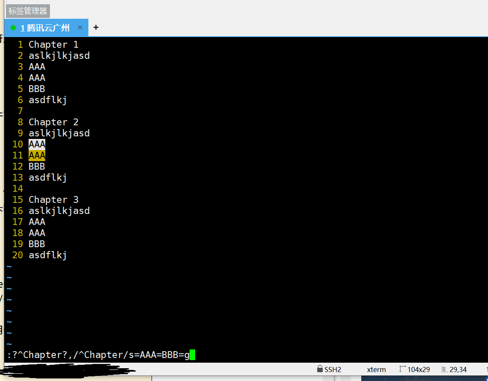  
这段命令的意思是`?`逆向往上查找首行`^`为"Chapter"的内容，找到后再顺向`/`查找首行`^`的"Chapter"。  
不过在上面的内容中为了避免`/`顺向查找，和替换的分隔符冲突所以在上面的示例中使用了`=`号来代替，当然使用`\`代替也是可以的，如下:  
```vim
?^Chapter?,/^Chapter/s\AAA\BBB\g
```  
  
加减号/偏移量:  
如果说使用了`??,//`的精确范围方式，但是你干好想对这个访问进行一下微调，比如多一行选中，少一行选中，那么这时候你就可以使用`+``-`号了。  
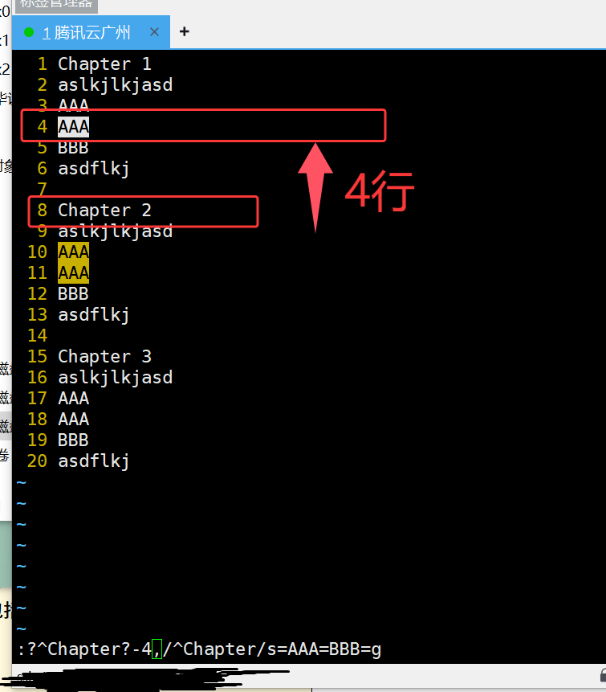   
例如这是在`?`逆向查找处使用了`-`号，即往行号少的方向偏移4,  
```vim
?^Chapter?-4,/^Chapter/s=AAA=BBB=g 
```  
而下面的`-5`也是同理。  
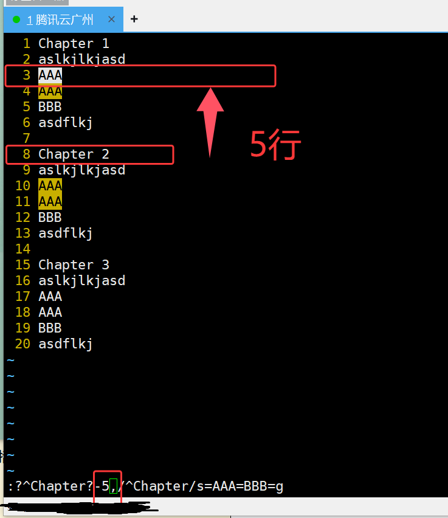   
```vim
?^Chapter?-5,/^Chapter/s=AAA=BBB=g 
```  
后面的`+`也是同理，往更行号更高的反向偏移。  
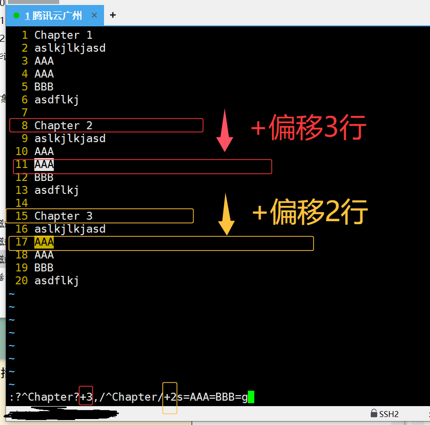   
```vim
?^Chapter?+3,/^Chapter/+2s=AAA=BBB=g
```  
  
在可视模式的执行替换，你一定会问可视模式是什么，不急，看完这点马上讲，你只需要理解可视模式是vim中的专门的选中模式，即可。  
当你使用可视模式选中了一段内容后可以直接按`:`键进入到末行模式，但此时的末行模式和平常的不太一样，你会看到`:'<,'>`这么一坨东西，请不要删除他，这一坨东西就表示我们可视模式选中的域。  
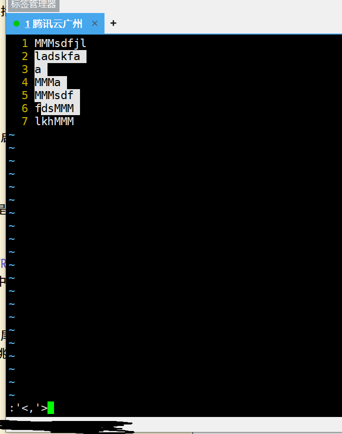  
这时候直接在后面输入替换命令即可。  
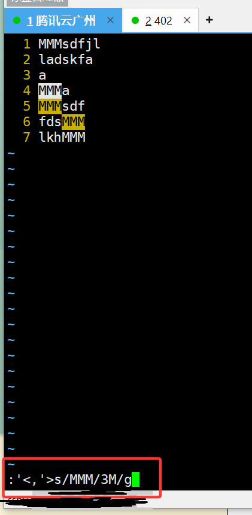  
```vim
:'<,'>s/MMM/3M/g
```  
## 
想了解更多内容可以查阅官方的手册，这不做过多赘述，末行模式还有其他很有用的小技巧，可以查阅文章后面的补充内容

## 可视模式
这个模式是vim编辑器的基础模式之一，但是对于基础运维来说确实不怎么用的上，但是如果你是使用vim编辑器进行开发的，那么这个模式可太重要了。  
进入可视模式使用键盘上的`v`键，这是你会看到编辑器的左下角出现了`VISUAL`的字样，如果你再使用hjkl移动一下光标就会发现不同了。  
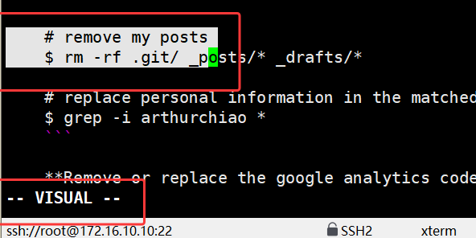  
是不是和word中用鼠标选中一块内容一样。如果你这个时候按`x`删除键的话那么你选中的内容就会被里面删除，并且回到普通模式。当然你也可以使用`<esc>`键取消选择回到普通模式。  
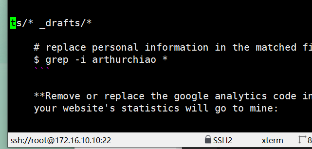  
小写的`v`是进入视图模式一个一个字符的选择，而大写的`V`则是进入行模式，左下角出现`VISUAL LINE`字样，这是使用前面的Nj即可实现快速选行。如下图使用命令`V10j`  
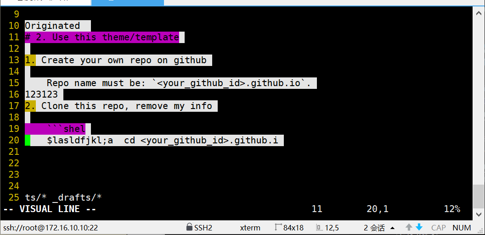  
### 复制，粘贴
复制粘贴在在Windows中只需要"CTRL+c","CTRL+v"即可，在vim的复制操作是`y`键，只需要再可视模式下选择需要复制的内容y即可，如果觉得`Vy`麻烦也可以直接`yy`默认复制一行，或者`Nyy`N为数字，复制N行，`yw`复制这个单词。    
然后通过操作光标移动到需要张贴的地方使用`p`键进行粘贴。  
### 剪切
剪切操作在Windows中只需要"CTRL+x","CTRL+v"即可实现，而在vim中更简单，直接使用`d`删除操作，在你删除内容的时候vim会将删除的内容临时缓存，可以使用`p`将临时缓存的内容贴出来，注意这里缓存是临时的，他只会缓存最新删除的内容，假设我将先`dw`将"hello"删除，然后再`dw`将，"world"删除，使用`p`贴出来的内容是"world",不论使用多少个`p`贴出来的内容都是"world"。  
  
# vimrc文件
vimrc 是 Vim 的配置文件，用于定制编辑器的行为和外观，我刚刚简单的介绍一下末行模式，是用于执行命令的，假设我希望每次打开文件的时候前面都会自动显示行号，那么每次打开vim的时候都需要执行:set nu命令，十分的麻烦，这是我们就可以将set number写在vimrc文件中，事实上绝大多数的末行命令都可以写在vimrc文件中。  
文件位置有两个，一个是位于`/etc/vim/vimrc`或者`/etc/vimrc`,的全局配置文件，另一个是Linux系统目录的`~/.vimrc`。如果我没有`~/.vimrc`文件我要怎么生成?  
- 使用touch/vim创建vimrc文件，但是这里并不推荐新手使用这种方创建
- 复制defaults.vim的模板文件，使用命令
```bash
cp /usr/share/vim/vim82/defaults.vim ~/.vimrc
```  
  
这里还是需要说明，vim编辑器很强大，你可以在编写vim脚本来快速执行一些代码，详细请查阅官方文档，这里只是做一点最简单的介绍。  
## defaults.vim文件
- 启用vim 增强，关闭vi兼容模式。  
```vim
set nocompatible
```  
- 允许退格键删除：行首缩进、换行符、插入开始前的字符。  
```vim
set history=200
```  
- 设置界面显示
```vim
set ruler          " 显示光标位置（行,列）
set showcmd        " 显示未完成的命令
set wildmenu       " 显示补全菜单
```  
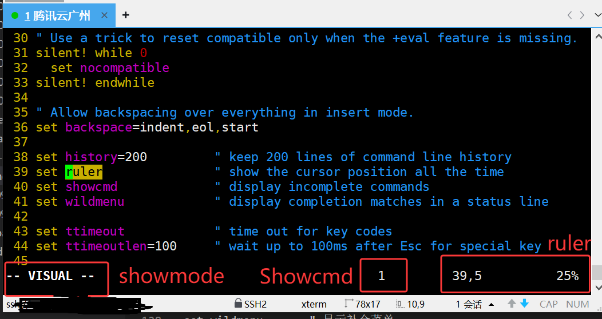    
- 显示设置,被截断的行显示 @@@ 而不是完全隐藏
```vim
set display=truncate
```  
- 键位映射,使插入模式的 Ctrl-U 可被撤销
```vim
inoremap <C-U> <C-G>u<C-U>
```  
## 按键映射
映射可以使你把一系列 Vim 命令绑定为一个单独的键，例如将使用F5键将光标所在的单词加上花括号，把 "amount" 变成 "{amount}"。我们只需要在编辑vimrc文件，在最后一行添加下面内容。  
```vim
map <F5> bi{<Esc>ea}<Esc>
```  
再例如使用修改使用TAB键，设置在TAB键位为配置所在行完后缩进2个空格。  
```vim
map <TAB> <Esc>^i<Space><Space><Esc>
```  
## autocmd自动命令
官方文档中对他的描述是"自动命令是一类特殊的命令。当某些事件，例如文件读入或改变缓冲区等事件发生时，它们会自动被执行"。乍一看，什么东西，白话"当满足什么什么条件的时候，帮我执行什么什么命令，全程不需要手动进行任何操作，只有条件满足的时候自动执行"你可能会联想到前面的按键映射，对他和按键映射很像，但是按键映射是使用按键映射是需要我们按下特定的按键或组合键才能触发，而自动命令是自动触发。  
首先我们可以先看一下autocmd的语法,我会对下面的参数进行解释。  
```vim
autocmd [group] {events} {file-pattern} [++nested] {command}
```  
- group: 组名，可选
- {events}: 事件,触发自动命令的条件，他是一个列表，中级用逗号分开
- {file-pattern}: 用于匹配文件类型，什么类型的文件能够触发事件，是.c还是.html
- \[++nested\]: 用于嵌套，可选
- {command}: 实际需要执行的命令
  
  
下面我给出示例:  
示例1： 当我使用vim编辑器编辑yaml格式文件的时候自动设置TAB为两个空格。  
```vim
augroup yaml_settings
  autocmd!
  autocmd FileType yaml setlocal tabstop=2 shiftwidth=2 expandtab softtabstop=2
augroup END
```  
如果你想了解更多比如事件，通配符，更高级的语法格式可以查阅官方文档。  
## Vim自定义命令
Vim允许你自己设置末行命令。  
例如我想设置一个命令`DFirst`执行命令后自动伤处第一行。  
```vim 
command DFirst 1delete
```  
自定义的命令需要用大写，且不能使用下划线和下面关键字`X`,`Next`,`Print`，自定义命令允许使用参数，但是参数必须使用`-nargs`开头表示，默认值是0 。这里只是做概念补充不再赘述。感兴趣的可以自行查阅官方文档。  
##  Vim 脚本
这里只简单讲述一下概念，Vim 脚本（Vimscript）Vim 自带的编程语言，用来写更复杂的逻辑  
# 补充
- 在普通模式下可以直接使用`ZZ`保存退出
- 在普通模式下可以使用`ZQ`不保存退出
- 在普通模式下，使用`*`可以在全文快速查找光标做在的这个单词
- 在普通模式下，使用`.`可以重复执行上一次的操作【如你上一次的操作是删除了3行文件，那么`.`会再次执行删除3行文件】
- 使用`CTRL+z`将vim编辑器挂入后台，在终端中输入命令`fg`恢复
- 不管你在什么模式中`CTRL+c`都能然你快速回到普通模式
## 从崩溃中恢复
这在Linux中是很常见的情况，可能因为网络波动，或计算机死机，又或者一下其他原因导致文件异常退出，但是我又没有保存文件，要怎么办，别担心，vim有一个缓存的交换文件，叫`.[文件名].swp`。这该文件在使用命令`ls`是看不到的，因为他是个隐藏文件，当完成编辑退出vim后vim会自动将这个文件进行删除。如图:  
  
如果这时候我们尝试编辑test.txt文件就会出现下面提示:  
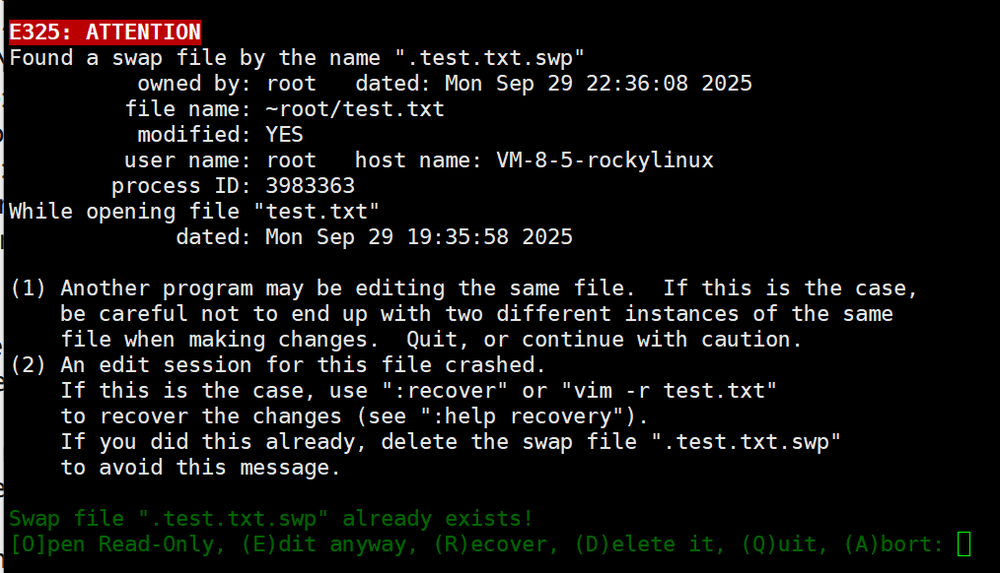  
你可在这一栏使用下面按键进行操作，`o`只读打开不会家长交换文件，`e`仍要编辑，无视交换机文件，即最开始的文件，`r`恢复刚刚没保存的内容`d`删除`.swp`交换文件，`q`，`a`退出vim。   
如果你在尝试恢复vim的过程中再次崩溃了怎么办，别担心vim会存在多个交换文件，第一个交换文件名为.swp,第二个为.swo，这时候我们也是使用下面命令来进行指定的交换机恢复。  
```bash
vim -r [交换文件名]
```  
在使用交换文件进入到vim编辑器后你可以正常使用保存命令`ZZ`或`:wq`也可以另存为【在末行模式下】在确认修改无误后再源文件进行替换  
```vim
w [新文件名称]
```

# 结尾
很高兴你能看到这里，这篇文件是关于Vim的入门讲解，我知道对于入门小白而已一次性理解这么多内容很难，你可以将这篇文章收藏，这篇文章已经讲vim中绝大所数的基础用法告诉你了，为什么说是基础，因为Vim还可以实现一次性编辑多个文件，分割窗口，通过vim插件实现扩展，还可以通过编辑vim脚本实现更加强调的功能。下不说如果要将这些内容全部写下来小白能不能看懂了，vim脚本我其实都不太会，我也是在写文章的时候查阅官方文档我才知道的vim脚本，vim脚本有vim8和vim9两个版本，语法完全不同。如果你想更加系统性的学习vim我推荐你去翻阅官方文档，从user_1.txt开始看。  
关于vim命令，短时间内你肯定无法一次性记住这么多的命令，所以不要急熟能生巧，多练习几次就好了，不仅是vim命令几乎所以的Linux命令都是一样的，不能死记硬背，多做多练才是最好的记忆。  
下一章，我会为你讲述 RHEL系统的网络配置与VMware 虚拟机网络模式详解。
# vim省流版
vim有三种视图/模式，他们可以相互切换，分别是普通模式，编辑模式，末行模式。
- 普通模式只能看，不能编辑，可以移动光标
- 编辑模式可以编辑，可以移动光标
- 末行模式用于执行末行命令，不能移动光标
在vim编辑器中用键盘的上下左右方向键来移动光标的位置。  
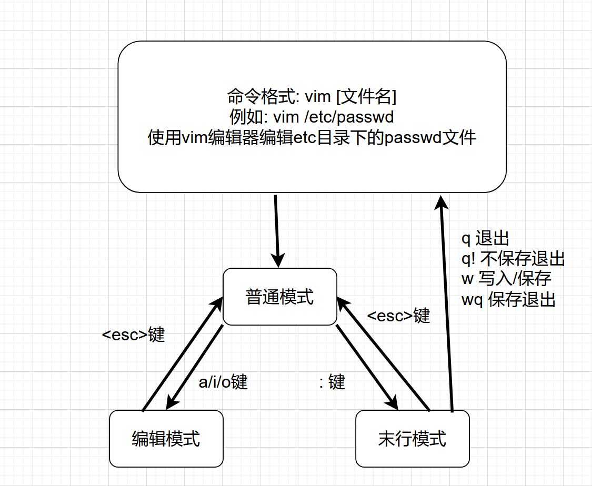