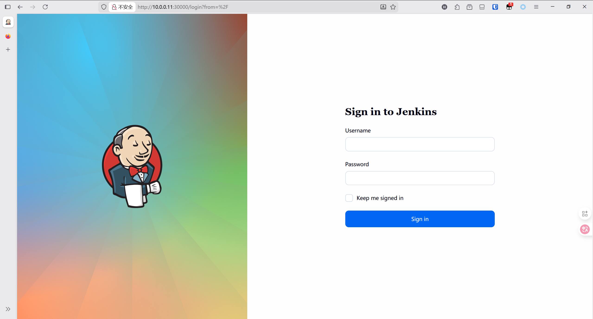

# helm 部署HA Jenkins

## 前期配置

创建目录

```bash
mkdir jenkins
cd jenkins/
```

创建 名称空间 

```bash
kubectl create ns jenkins
```

创建Jenkins-pv资源清单`jenkins-pv.yaml`，内容如下

```yaml
apiVersion: v1
kind: PersistentVolume
metadata:
  name: jenkins-pv
  namespace: jenkins
spec:
  storageClassName: jenkins-pv
  accessModes:
  - ReadWriteOnce
  capacity:
    storage: 20Gi
  persistentVolumeReclaimPolicy: Retain
  hostPath:
    path: /opt/jenkins_data

---
apiVersion: storage.k8s.io/v1
kind: StorageClass
metadata:
  name: jenkins-pv
provisioner: kubernetes.io/no-provisioner
volumeBindingMode: WaitForFirstConsumer
```

创建Jenkins ServiceAccounts 资源清单`jenkins-sa.yaml`,内容如下

```yaml
---
apiVersion: v1
kind: ServiceAccount
metadata:
  name: jenkins
  namespace: jenkins
---
apiVersion: rbac.authorization.k8s.io/v1
kind: ClusterRole
metadata:
  annotations:
    rbac.authorization.kubernetes.io/autoupdate: "true"
  labels:
    kubernetes.io/bootstrapping: rbac-defaults
  name: jenkins
rules:
- apiGroups:
  - '*'
  resources:
  - statefulsets
  - services
  - replicationcontrollers
  - replicasets
  - podtemplates
  - podsecuritypolicies
  - pods
  - pods/log
  - pods/exec
  - podpreset
  - poddisruptionbudget
  - persistentvolumes
  - persistentvolumeclaims
  - jobs
  - endpoints
  - deployments
  - deployments/scale
  - daemonsets
  - cronjobs
  - configmaps
  - namespaces
  - events
  - secrets
  verbs:
  - create
  - get
  - watch
  - delete
  - list
  - patch
  - update
- apiGroups:
  - ""
  resources:
  - nodes
  verbs:
  - get
  - list
  - watch
  - update
---
apiVersion: rbac.authorization.k8s.io/v1
kind: ClusterRoleBinding
metadata:
  annotations:
    rbac.authorization.kubernetes.io/autoupdate: "true"
  labels:
    kubernetes.io/bootstrapping: rbac-defaults
  name: jenkins
roleRef:
  apiGroup: rbac.authorization.k8s.io
  kind: ClusterRole
  name: jenkins
subjects:
- apiGroup: rbac.authorization.k8s.io
  kind: Group
  name: system:serviceaccounts:jenkins
```

部署

```bash
kubectl apply -f jenkins-pv.yaml
kubectl apply -f jenkins-sa.yaml
```

## 配置helm chart包

```bash
helm fetch jenkinsci/jenkins --untar
```

编辑`jenkins/values.yaml`文件

```yaml
# 修改PV的值，为前面的PV名称
storageClass: jenkins-pv

#设置service Account 
serviceAccount:
  create: false
  # Service account name is autogenerated by default
name: jenkins
annotations: {}

#如果是使用节点暴露还需要配置service
  serviceType: NodePort

  # -- k8s service clusterIP. Only used if serviceType is ClusterIP
  clusterIp:
  # -- k8s service port
  servicePort: 8080
  # -- k8s target port
  targetPort: 8080
  # -- k8s node port. Only used if serviceType is NodePort
  nodePort: 30000
```

## 部署

```bash
helm install -n jenkins jenkins jenkins/
```

```bash
[root@master jenkins]# helm install -n jenkins jenkins jenkins/
NAME: jenkins
LAST DEPLOYED: Tue Dec 16 21:37:35 2025
NAMESPACE: jenkins
STATUS: deployed
REVISION: 1
NOTES:
1. Get your 'admin' user password by running:
  kubectl exec --namespace jenkins -it svc/jenkins -c jenkins -- /bin/cat /run/secrets/additional/chart-admin-password && echo
2. Get the Jenkins URL to visit by running these commands in the same shell:
  export NODE_PORT=$(kubectl get --namespace jenkins -o jsonpath="{.spec.ports[0].nodePort}" services jenkins)
  export NODE_IP=$(kubectl get nodes --namespace jenkins -o jsonpath="{.items[0].status.addresses[0].address}")
  echo http://$NODE_IP:$NODE_PORT

3. Login with the password from step 1 and the username: admin
4. Configure security realm and authorization strategy
5. Use Jenkins Configuration as Code by specifying configScripts in your values.yaml file, see documentation: http://$NODE_IP:$NODE_PORT/configuration-as-code and examples: https://github.com/jenkinsci/configuration-as-code-plugin/tree/master/demos

For more information on running Jenkins on Kubernetes, visit:
https://cloud.google.com/solutions/jenkins-on-container-engine

For more information about Jenkins Configuration as Code, visit:
https://jenkins.io/projects/jcasc/


NOTE: Consider using a custom image with pre-installed plugins
[root@master jenkins]# kubectl get po -n jenkins 
NAME        READY   STATUS    RESTARTS   AGE
jenkins-0   2/2     Running   0          7m29s
```

## 访问

查看SVC

```bash
[root@master jenkins]# kubectl get svc -n jenkins 
NAME            TYPE        CLUSTER-IP     EXTERNAL-IP   PORT(S)          AGE
jenkins         NodePort    10.68.47.147   <none>        8080:30000/TCP   15m
jenkins-agent   ClusterIP   10.68.100.20   <none>        50000/TCP        15m
[root@master jenkins]# 
```

 查看密码,登入用户`**admin**`

```bash
jsonpath="{.data.jenkins-admin-password}"
secret=$(kubectl get secret -n jenkins jenkins -o jsonpath=$jsonpath)
echo $(echo $secret | base64 --decode)
```

查看访问地址

```bash
jsonpath="{.spec.ports[0].nodePort}"
NODE_PORT=$(kubectl get -n jenkins -o jsonpath=$jsonpath services jenkins)
jsonpath="{.items[0].status.addresses[0].address}"
NODE_IP=$(kubectl get nodes -n jenkins -o jsonpath=$jsonpath)
echo http://$NODE_IP:$NODE_PORT/login
```

 