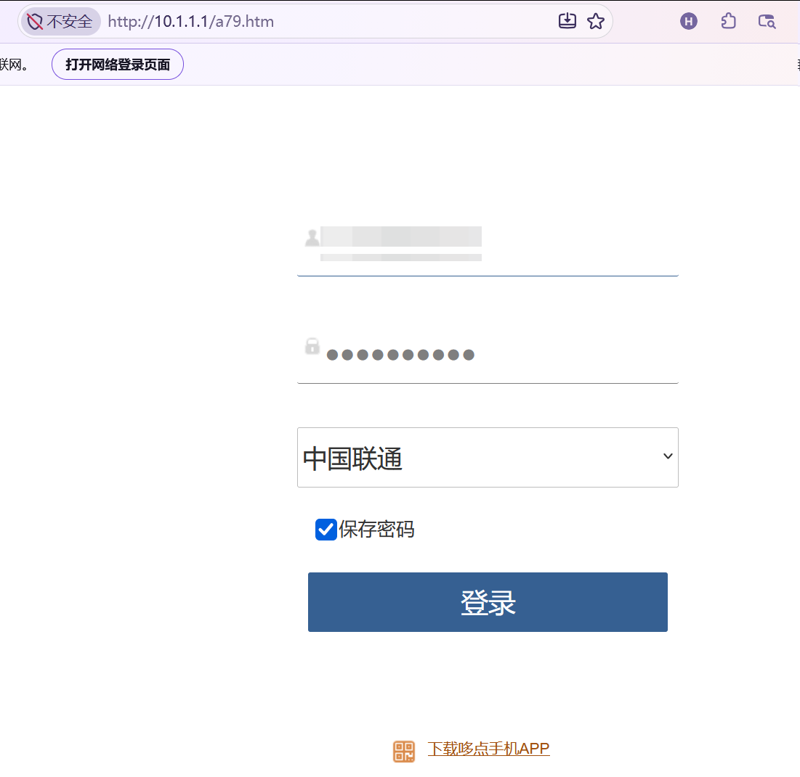
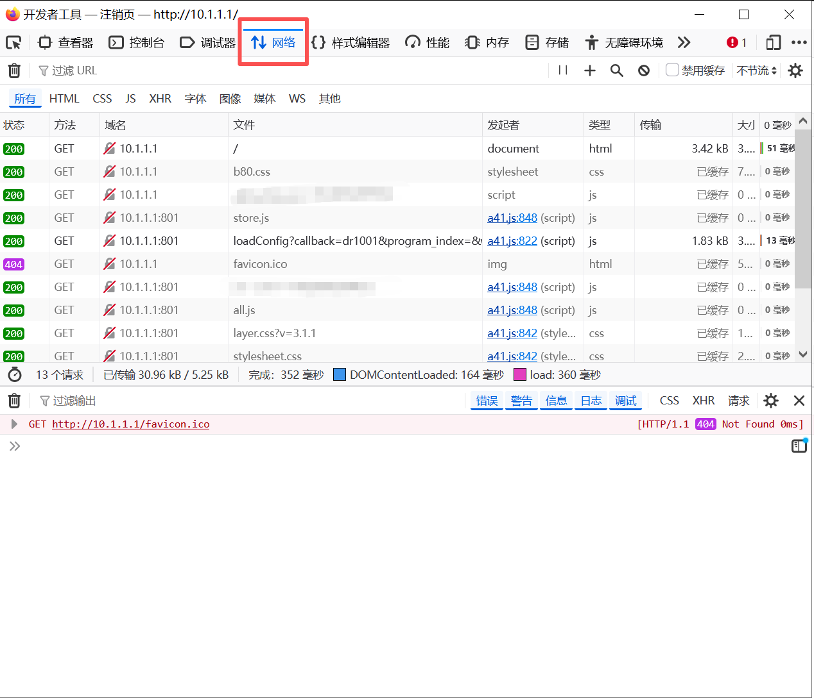
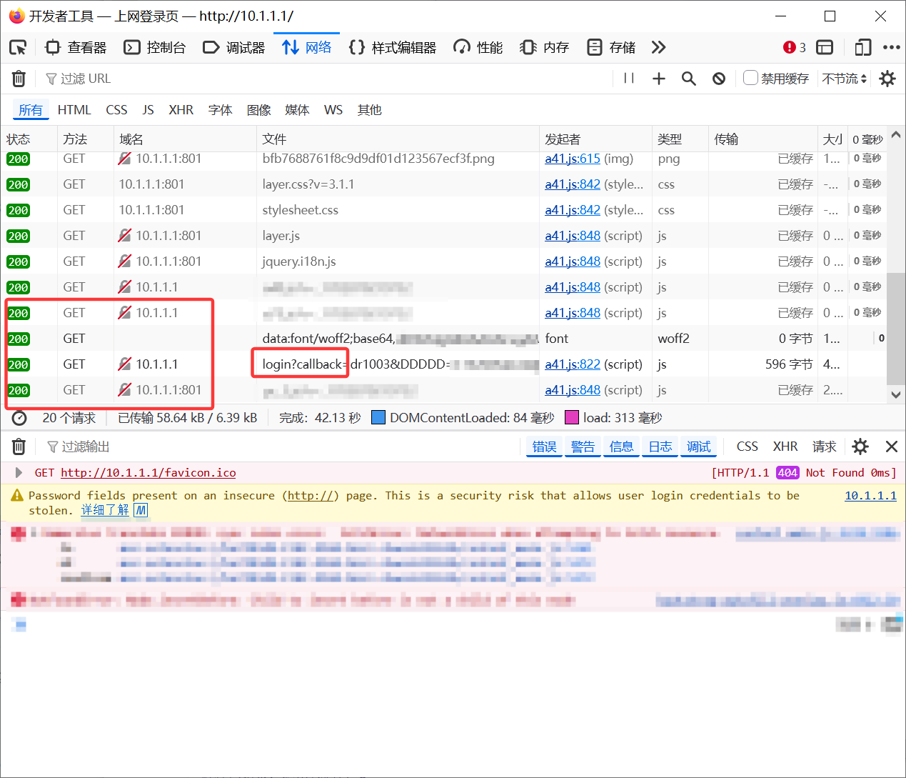
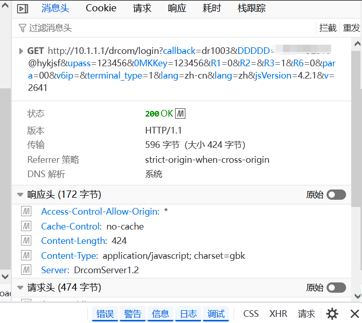
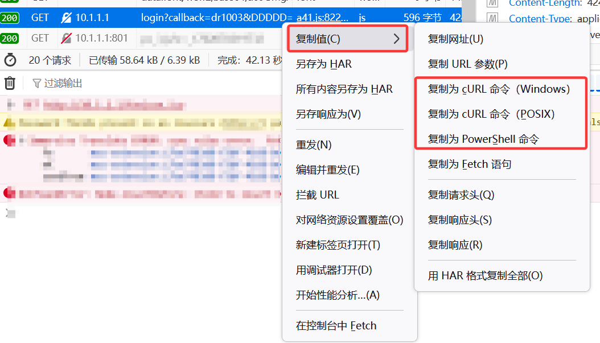
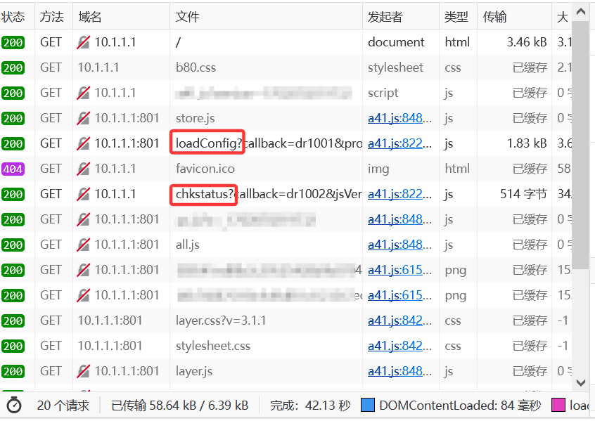
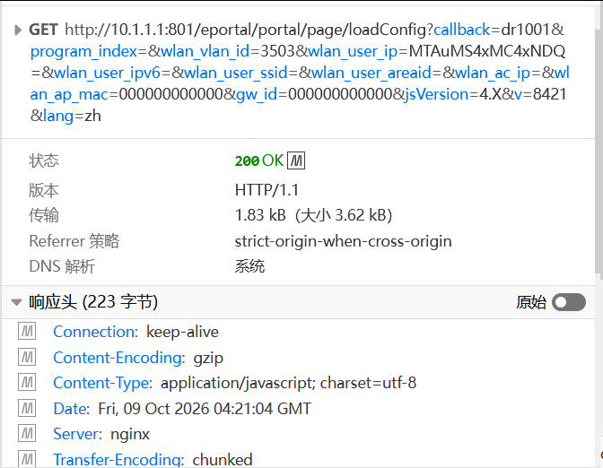
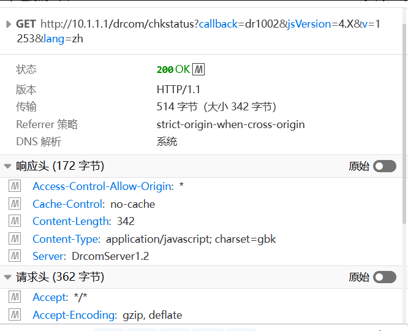
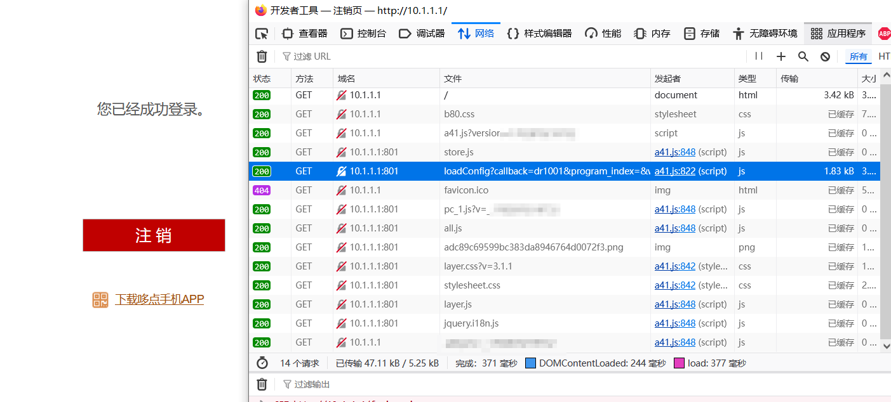

## 前言

你肯定好奇，大学计算机课程学Python，学网络，学AI，这些东西好像永远只是理论，他你学他的唯一作用似乎只是为了应付考试。实战这一系列文章就是教你如何将理论运用到实践，方便你自己的生活。  

只要你上过大学，你就一定用过校园网，每次连上校园网都需要输入密码进行认证。你有没有想过这一步骤能用计算机自动完成。

## 先决条件

* 一个校园网账户
* 一台能连接校园网的电脑
* Python 3.9.13【不是必要的】如果你认真看了这篇文章，你会了解自动登入校园网的办法有很多。

## 抓包

在正式开始前我们需要先了解一下，校园网的认证条件，要完成认证至少需要下面3个条件。


1. 账户（你是谁）
2. 密码（确定你的身份是否合法）
3. IP或MAC（最终要认证的对象）

这是一个校园网络登入界面。先不要登入校园网

 

有账户，密码，还有运营商选择。你不好奇这个认证过程吗？校园网怎么知道我是我的。我们按F12打开浏览器开发工具，这里使用Firefox做演示，edge和chrome都一样有F12这个功能。这里选择网络【Network】，然后刷新这个界面。

 

这里你会看到许多网络数据包。但是不要急，这里的大多数包对我们都没用。我们这里直接先无视这些网络包。现在我们先无视这些网络包。先在账户密码一栏中输入账户密码。然后点击登入。会发现这里多了几个包。**（注意: 每个校园网认证体系都不一样，但是大体的交互逻辑是一致的）**

 

看了login这个单词了吗？这个就是完成认证的核心数据包。我们来看看这里面包含了什么信息。点开他你会看到如下信息。

 

从这张图可以分析出来，认证提交方式是Get【有的学校是post不管是哪一个问题都不大】， DDDDD是我们输入的账户认证信息，upass是我们输入的密码信息【每个学校的都不一样，但是信息是类似的】。但是我们似乎还少了些信息，比如之前提到的我们电脑的IP地址，MAC地址。我们这里先不管。我们先把脚本用AI写出来。

**这里再次重申，每个学校的都不一样【博主使用过ppp拨号校园网，Get，Post，的都用过，单数据包认证，和多数据包认证的都用过，这个学校是多数据包，后面会讲。】**

这里选中这个数据包，右键找到复制选项，随便选一个都行，反正AI会自动识别这些内容。  
 

这个是我使用Deepseek生成出来的脚本，当然你使用千问或豆包都没什么问题

```python
# ============ 配置区 ============
$username = "1111111111@hykjsf"   # 校园网账号
$password = "123456"                # 密码
$portal   = "http://10.1.1.1/drcom/login"
# ================================

# URL 编码用户名（@ 需要转成 %40）
$encodedUser = [uri]::EscapeDataString($username)

$uri = "$portal" + "?callback=dr1003" +
       "&DDDDD=$encodedUser" +
       "&upass=$password" +
       "&0MKKey=123456" +
       "&R1=0&R2=&R3=1&R6=0&para=00&v6ip=&terminal_type=1&lang=zh-cn&jsVersion=4.2.1&v=1729&lang=zh"

$session = New-Object Microsoft.PowerShell.Commands.WebRequestSession
$session.UserAgent = "Mozilla/5.0 (Windows NT 10.0; Win64; x64) AppleWebKit/537.36 (KHTML, like Gecko) Chrome/154.0.0.0 Safari/537.36"

try {
    $resp = Invoke-WebRequest -UseBasicParsing -Uri $uri -WebSession $session `
        -Headers @{
            "Accept"          = "*/*"
            "Accept-Encoding" = "gzip, deflate"
            "Accept-Language" = "zh,zh-CN;q=0.9"
            "Referer"         = "http://10.1.1.1/"
        }
    Write-Host "[$(Get-Date -Format 'HH:mm:ss')] 认证请求已发送，状态码: $($resp.StatusCode)"
    Write-Host "返回内容: $($resp.Content)"
} catch {
    Write-Host "[$(Get-Date -Format 'HH:mm:ss')] 认证失败: $_"
}
```

**然后运行这个脚本。如果是单数据包认证的那么这个时候就已经大功告成了，你刷新一下你的登入界面应该是已经认证成功了。如果你跟博主一样没有认证成功，那么就说明你的数据包可能是多包认证的或者有其他的一些问题，即在这个认证包之前肯定还有一个配置数据包。**

还记得我之前说的，这个认证包里面没有IP，MAC等地址信息吗？没有认证成功的，s我们回到登入界面，重新刷新一下界面，以获取到最初始的网络数据包。

 

这时候你注意到了两个内容，Config【配置】status【状态】，我们来分别查看这两个包的内容。

 

看到这里，之前的疑惑都解除了，这个配置包里面包含了我们所需要的网络信息。wlan_vlan_id我接入校园网的VLANID 3503，wlan_user_ip用户IP MTAuMS4xMC4xNDQ，这里貌似是加密过的【图中这里是base64 加密的内容，解密后为10.1.10.144】，没有分配IPV6地址也没有IPV6信息，并且由于我们是有线接入也没有SSID信息，和AC AP信息。（额外补充一点，后续博主再测试无线网络的时候也没看到SSID和AC AP处有相对应的信息载荷，应该是学院没有配置相关内容，仅需要IP，VLAN等信息即可）

然后我们再来看看状态。

 

看起来好像没什么有用的。不管了，我们把loadConfig，chkstatus，和前面的login？ 全部复制下来丢给AI吧。

```python
import requests
import re
import json
import base64
import socket
import time


class CampusNetAutoLogin:
    def __init__(self, username, password, domain="hykjsf", ip="10.1.1.1"):
        self.base_url = f"http://{ip}"
        self.username = username
        self.password = password
        self.domain = domain
        self.session = requests.Session()

        self.headers = {
            "User-Agent": "Mozilla/5.0 (Windows NT 10.0; Win64; x64; rv:157.0) Gecko/20100101 Firefox/157.0",
            "Accept": "*/*",
            "Accept-Language": "zh-CN,zh;q=0.9,zh-TW;q=0.8,zh-HK;q=0.7,en-US;q=0.6,en;q=0.5",
            "Accept-Encoding": "gzip, deflate",
            "Connection": "keep-alive",
            "Referer": f"{self.base_url}/a79.htm"
        }

        self.v = ""
        self.jsVersion = ""
        self.wlan_vlan_id = "3503"

    def get_local_ip(self):
        try:
            s = socket.socket(socket.AF_INET, socket.SOCK_DGRAM)
            s.connect(("8.8.8.8", 80))
            ip = s.getsockname()[0]
            s.close()
            return ip
        except Exception:
            return "0.0.0.0"

    def parse_jsonp(self, text):
        """解析 JSONP，同时兼容 result 为数字/字符串的情况"""
        if not text:
            return None
        match = re.search(r'\((.*)\)', text, re.DOTALL)
        if match:
            json_str = match.group(1).strip()
            try:
                return json.loads(json_str)
            except json.JSONDecodeError:
                # 有些返回不是标准 JSON，尝试宽松处理
                try:
                    return json.loads(json_str.replace("'", '"'))
                except Exception:
                    return None
        # 如果不是 JSONP，尝试直接当 JSON 解析
        try:
            return json.loads(text)
        except Exception:
            return None

    def load_config(self):
        print("[*] 正在获取配置信息...")
        url = f"{self.base_url}:801/eportal/portal/page/loadConfig"

        local_ip = self.get_local_ip()
        encoded_ip = base64.b64encode(local_ip.encode()).decode()

        params = {
            "callback": "dr1001",
            "program_index": "",
            "wlan_vlan_id": self.wlan_vlan_id,
            "wlan_user_ip": encoded_ip,
            "wlan_user_ipv6": "",
            "wlan_user_ssid": "",
            "wlan_user_areaid": "",
            "wlan_ac_ip": "",
            "wlan_ap_mac": "000000000000",
            "gw_id": "000000000000",
            "jsVersion": "4.X",
            "v": str(int(time.time() * 1000)),
            "lang": "zh"
        }

        try:
            resp = self.session.get(url, params=params, headers=self.headers, timeout=5)
            data = self.parse_jsonp(resp.text)

            if data:
                self.v = data.get('v', str(int(time.time() * 1000)))
                self.jsVersion = data.get('jsVersion', '4.2.1')
                print(f"[+] 获取配置成功: v={self.v}, jsVersion={self.jsVersion}")
                return True
            else:
                print("[-] 解析配置失败，使用默认参数")
                self.v = str(int(time.time() * 1000))
                self.jsVersion = "4.2.1"
                return True
        except Exception as e:
            print(f"[-] 获取配置出错: {e}")
            return False

    def _is_login_success(self, data, raw_text):
        """统一判断登录是否成功，兼容多种返回格式"""
        if data is not None:
            # 取出 result，转成字符串方便比较
            result = data.get('result', data.get('ret_code', data.get('code', '')))
            result_str = str(result).strip()
            msg = str(data.get('msg', data.get('message', '')))

            print(f"    解析结果: result={result_str}, msg={msg}")

            # 常见的成功码（数字或字符串）
            success_codes = {"10000", "0", "1", "200", "success"}
            if result_str.lower() in success_codes:
                return True

            # 消息里含成功关键字
            lower_all = (result_str + msg + json.dumps(data, ensure_ascii=False)).lower()
            if any(k in lower_all for k in ["success", "成功", "登录成功"]):
                return True

        # 兜底：直接在原始文本里找成功关键字
        lower_text = raw_text.lower()
        # 注意：要避免 "不成功"/"失败" 之类的误判
        if "10000" in raw_text and "失败" not in raw_text:
            return True
        if ("success" in lower_text or "成功" in raw_text) and "失败" not in raw_text:
            return True

        return False

    def login(self):
        print("[*] 正在尝试登录...")
        url = f"{self.base_url}/drcom/login"

        full_username = f"{self.username}@{self.domain}"

        params = {
            "callback": "dr1003",
            "DDDDD": full_username,
            "upass": self.password,
            "0MKKey": self.password,
            "R1": "0",
            "R2": "",
            "R3": "1",
            "R6": "0",
            "para": "00",
            "v6ip": "",
            "terminal_type": "1",
            "lang": "zh-cn",
            "jsVersion": self.jsVersion,
            "v": self.v,
        }

        try:
            resp = self.session.get(url, params=params, headers=self.headers, timeout=10)
            raw_text = resp.text or ""
            print(f"    原始响应: {raw_text[:300]}")

            data = self.parse_jsonp(raw_text)

            if self._is_login_success(data, raw_text):
                print("[+] 登录成功！")
                return True
            else:
                print("[-] 登录失败或返回格式无法识别。")
                return False

        except Exception as e:
            print(f"[-] 登录请求出错: {e}")
            return False

    def check_status(self):
        print("[*] 检查网络状态...")
        url = f"{self.base_url}/drcom/chkstatus"
        params = {
            "callback": "dr1002",
            "jsVersion": self.jsVersion,
            "v": self.v,
            "lang": "zh"
        }

        try:
            resp = self.session.get(url, params=params, headers=self.headers, timeout=5)
            print(f"    状态接口响应: {resp.text[:200]}")
            if resp.status_code == 200:
                try:
                    test_resp = requests.get("http://www.baidu.com", timeout=3)
                    if test_resp.status_code == 200:
                        print("[+] 网络连通性测试成功，可以访问互联网。")
                        return True
                except Exception:
                    pass
                print("[*] 认证服务器响应正常，但互联网连通性未知。")
                return True
            return False
        except Exception as e:
            print(f"[-] 检查状态出错: {e}")
            return False


if __name__ == "__main__":
    USERNAME = "111111111"
    PASSWORD = "123456"
    DOMAIN = "hykjsf"
    SERVER_IP = "10.1.1.1"

    loginer = CampusNetAutoLogin(USERNAME, PASSWORD, DOMAIN, SERVER_IP)

    if loginer.load_config():
        if loginer.login():
            loginer.check_status()
        else:
            print("登录过程被中断。")
    else:
        print("无法获取配置，请检查网络连接。")
```

我们现在再运行一下脚本。不出意外应该是已经成功了的。

接下来，我们使用AI来编写一个bat脚本，实现开机自启【添加开机自启不一定好用，校园网认证反应普遍比较慢，需要开机后1分钟左右才能做出反应，但你可以尝试一下开机自启。】。

```bash
   @echo off
   chcp 65001 >nul
   cd /d "E:\python program\HYSF_net"
   :: 激活您的conda环境（假设环境名叫 hysf_env）
   call conda activate hysf_env
   py main.py
   pause
```

## 总结

现在校园网一般采用以下了两种方式进行认证。

### Get Post单包认证

get和post的本质区别在于信息载荷，get请求会将信息载荷全部放在URL中，例如用户信息，IP信息等内容。而post请求会将信息载荷放置在body中。但是本质还是一样的。一个数据包发给服务器，身份合法返回一个认证成功。并且允许这个IP主体访问互联网。反之则认证失败，无法上网。

### 多包认证（DrCom）

DrCom的认证体系稍微有点复杂，这里以此校园网为例。


1. 首次访问会向服务器提交Config的配置信息dr1001此时服务器可能会创建向对应的会话。为什么是可能呢，因为从config的响应来看，并没有提供salt，Token等信息。所以只能从服务器端给出可能的结论。并且如果是已经认证成功的IP就不会触发后面的chkstatus1002等步骤。如下图所示并没有出现chkstatus的包发送。

   
2. 如果是未登入的会触发chkstatus，但是chkstatus并不会参与认证，可能只是负责本地浏览器的页面状态控制。
3. 输入账号密码，点击登入，发送login 1003触发认证。认证成功则放行此IP数据，失败返回Error包。
